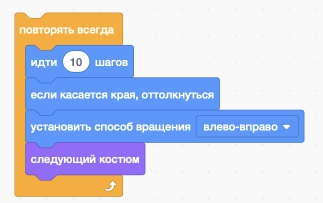

## Работа с системой Scratch. Бесконечное движение.

**Описание занятия:** 
Познакомиться со средой Scratch. Увидеть WOW-эффект (можно управлять персонажем и он интересно, "волшебно" двигается)

1. Открываем среду <a href = "https://scratch.mit.edu" target = "_blank"> Scratch </a>
2. Делаем программу с кодом:

