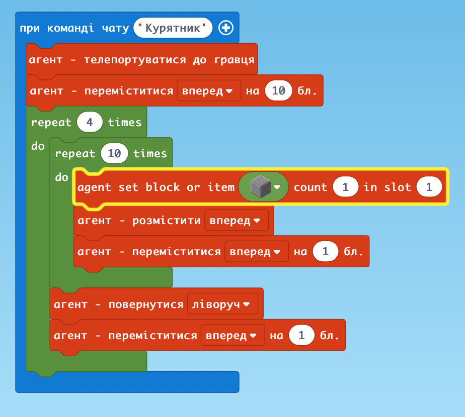
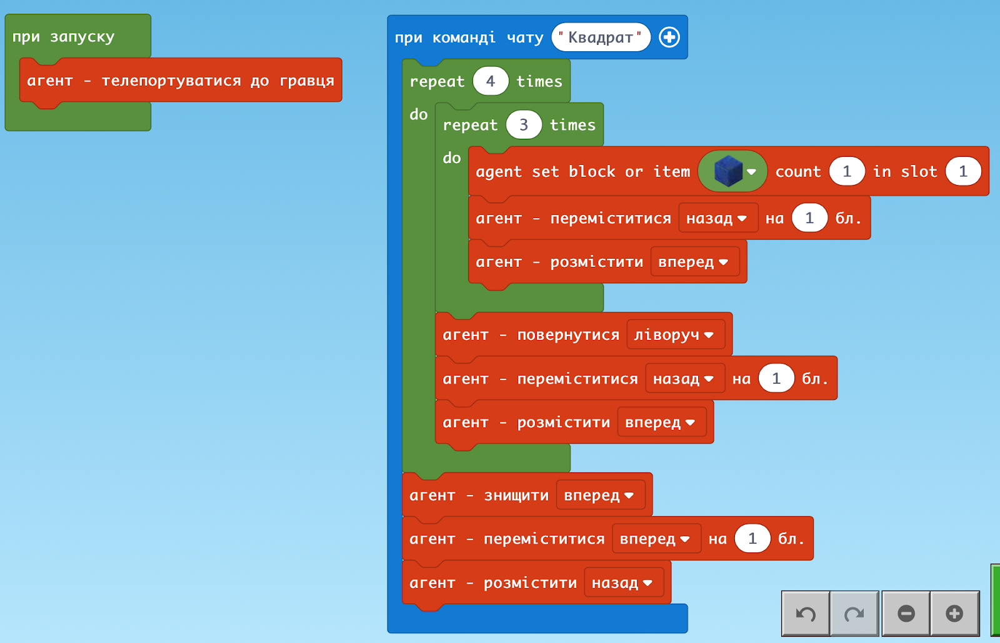
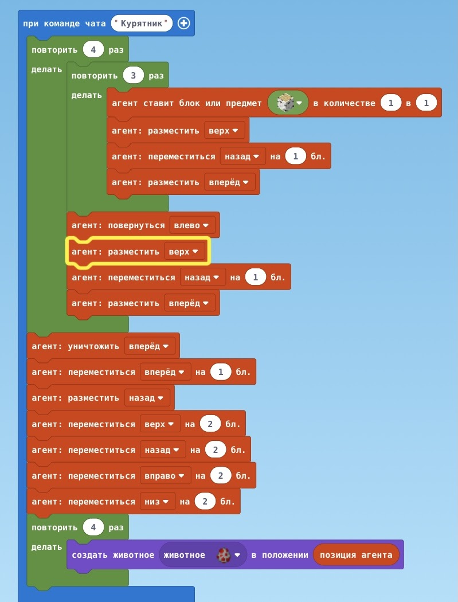
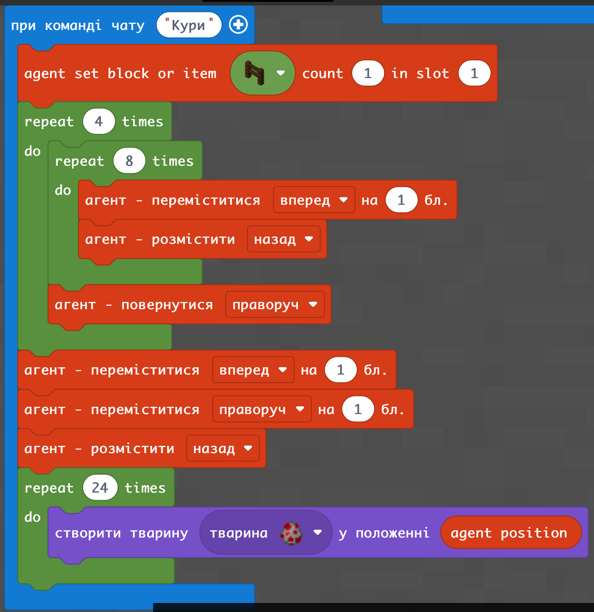
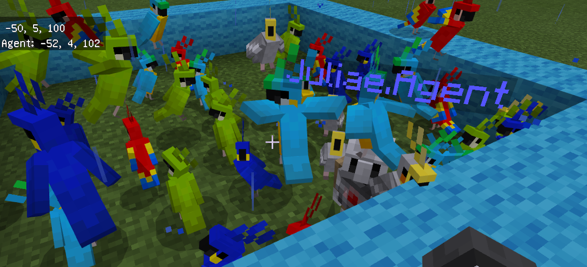
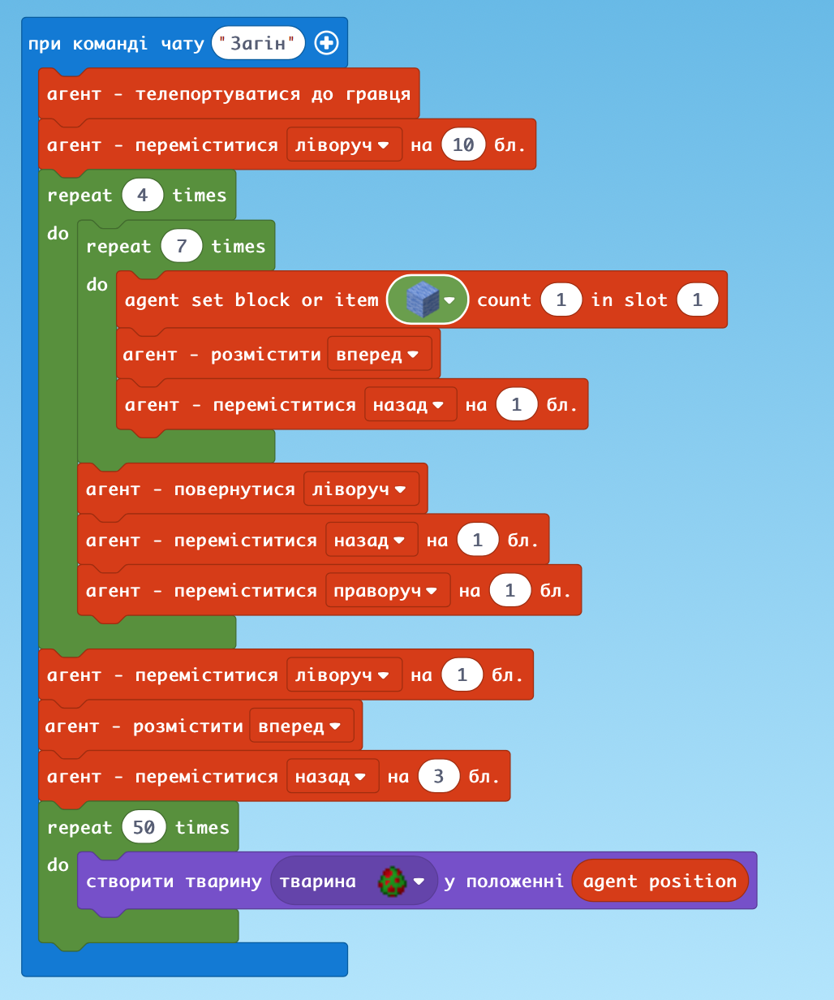

# Заняття 10.

### Курятник (варіант без курей)

Відповідь ДЗ

### Агент будує квадратний загін - варіант №2

### З курками

### Огорожа з курами - варіант №3

### Загін з папугами

### ДЗ: 
зробити ферму з пандами, де росте бамбук
