# Заняття 14. Змінні

### Змінні

Будуємо квадрат використовуючи змінні.

Посунемо Агента нагору

Створити змінну - при команді чату і тиснемо +

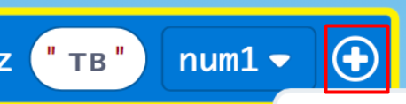

### Перейменовуємо цю нову змінну

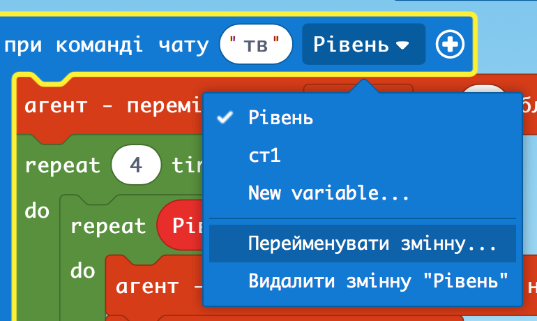

### Вставляємо таку ж назву змінної у самий код

Кількість блоків

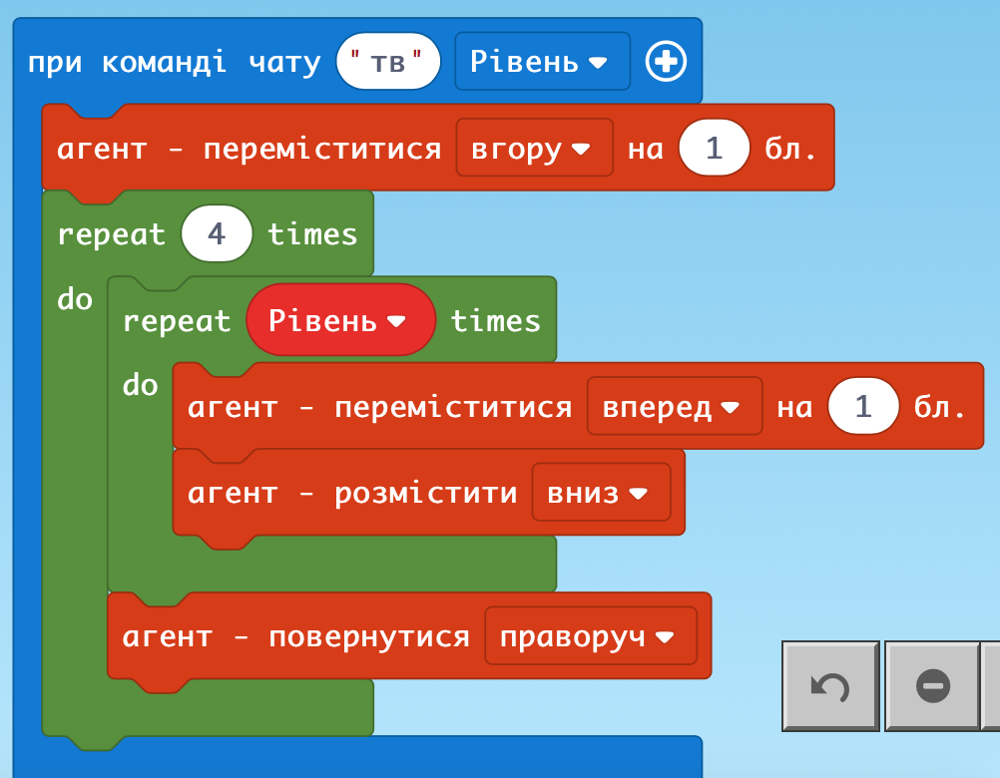

### Тестуємо

Коли в чаті пишемо команду, то одразу вказуємо значення змінної через пробіл

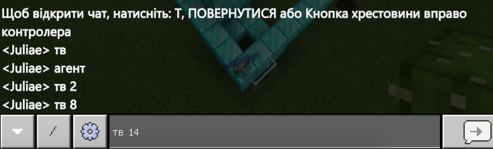

### Побудова прямокутника

Створюємо нову команду і ще одну змінну

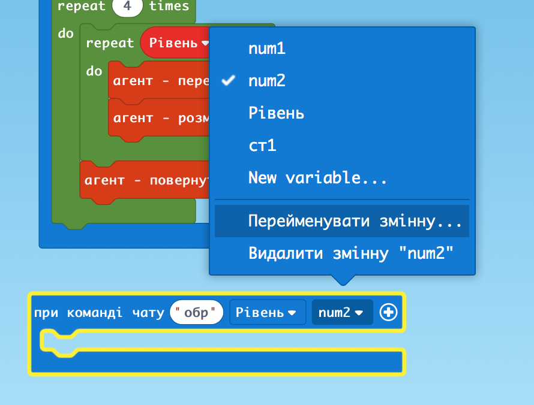

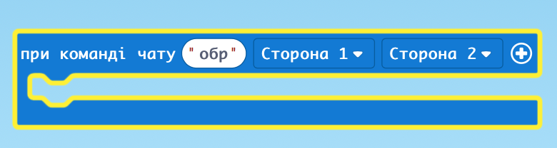

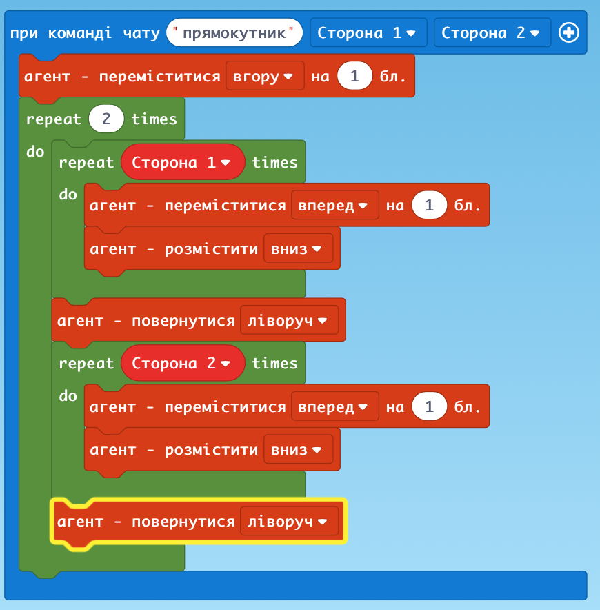

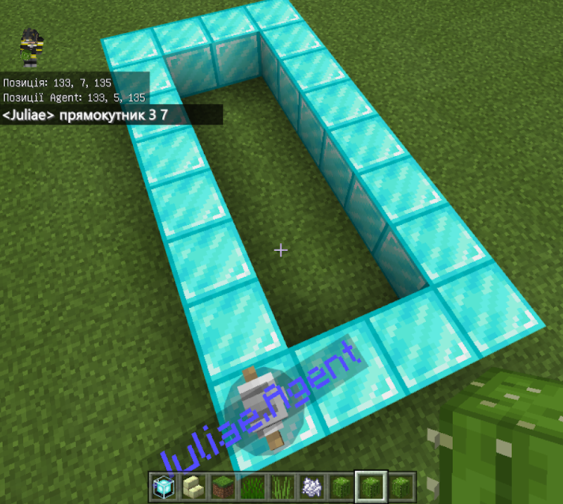

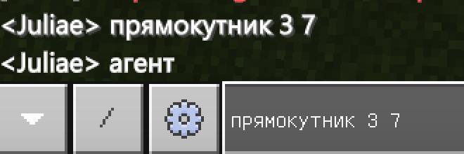

### Тепер скопіюємо програму і переробимо на побудову ще у висоту

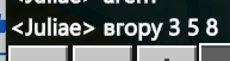

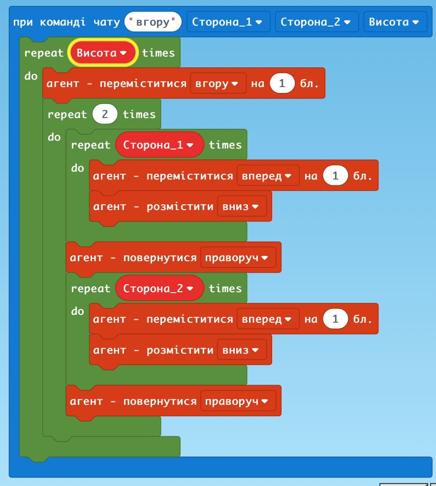

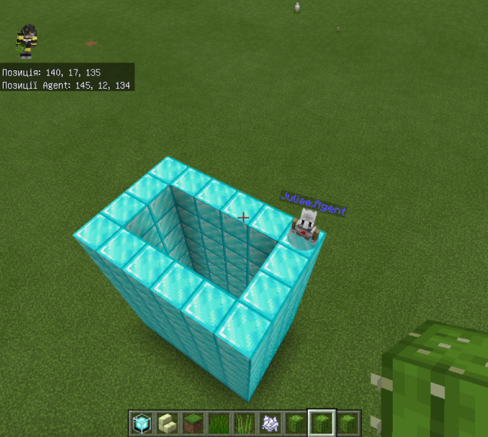

### Огорожа

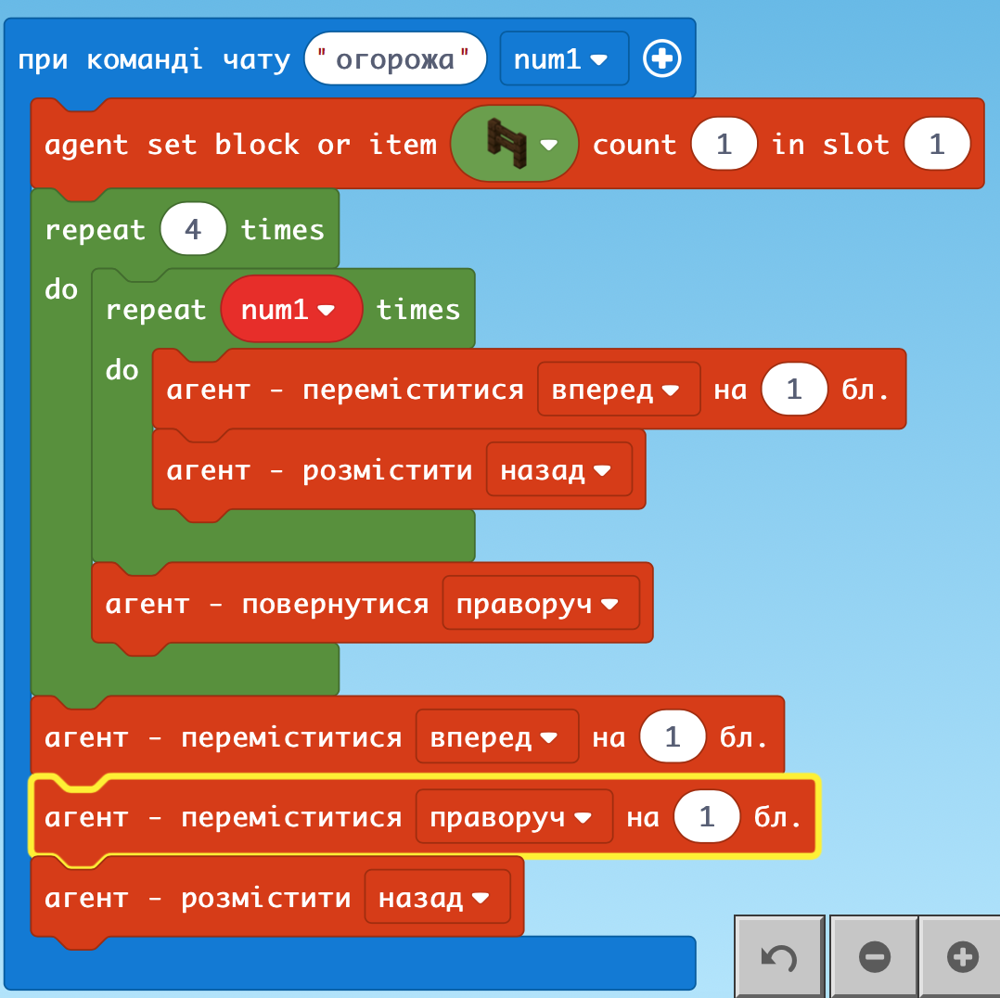

### Огорожа з Ламами

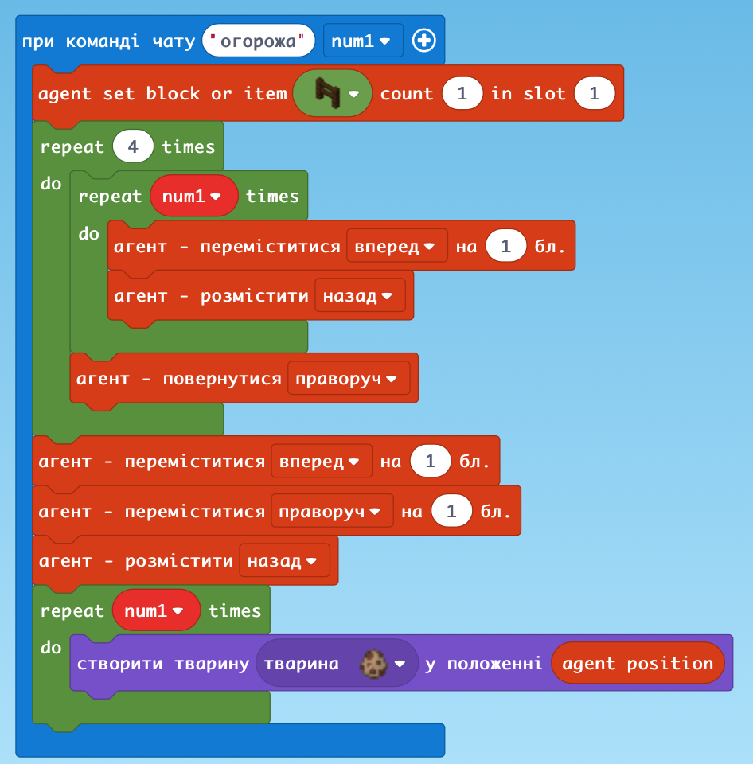

### Напад летючих мишей

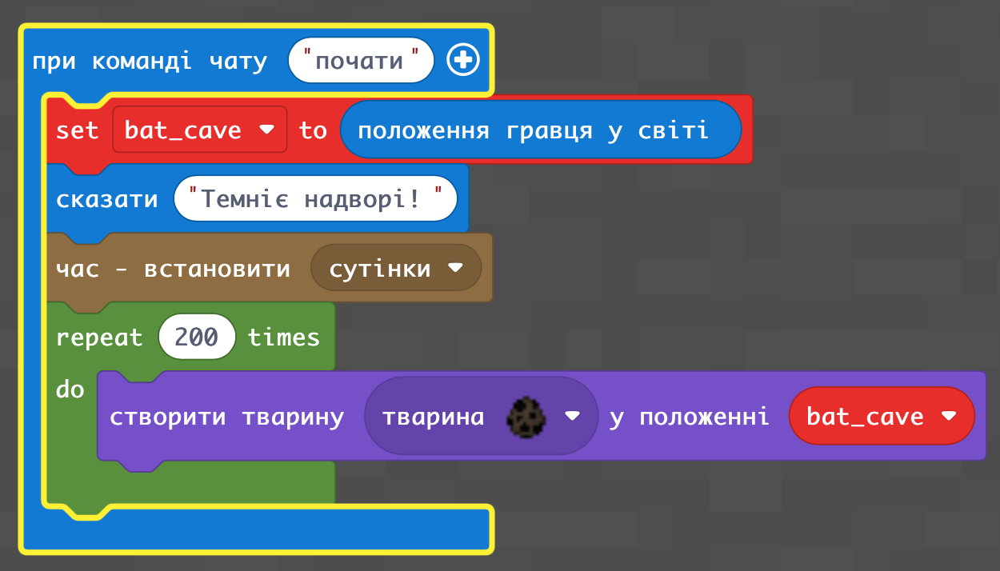

### Окремо ще додаємо тварин

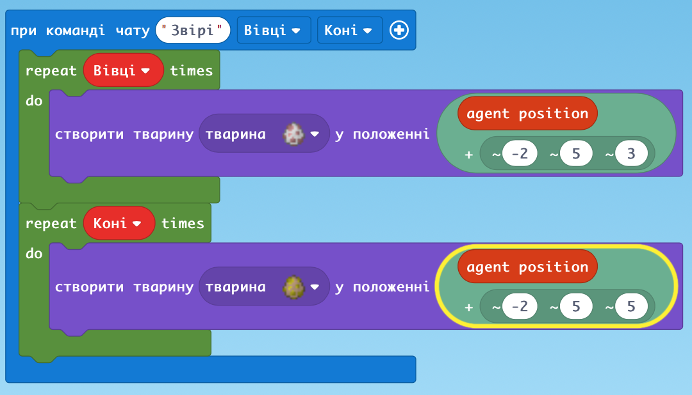

### Додаткове завдання: створити монстрів

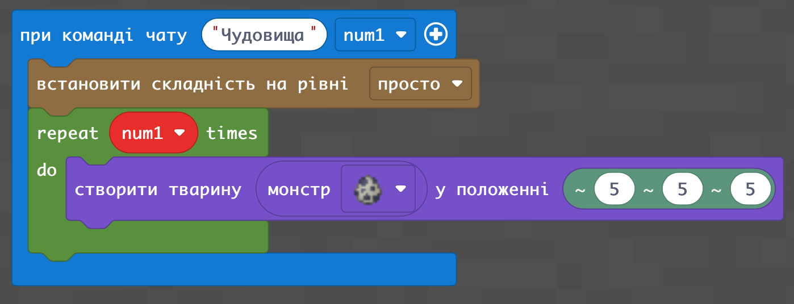

### ДЗ: 
Використовуючи змінні запрограмувати Агента, щоб він збудував прозорий басейн (висота, ширина та довжина - задаються змінними), налив води  та запустив туди риби (кількість риби = висоті басейна)

### Відповідь:

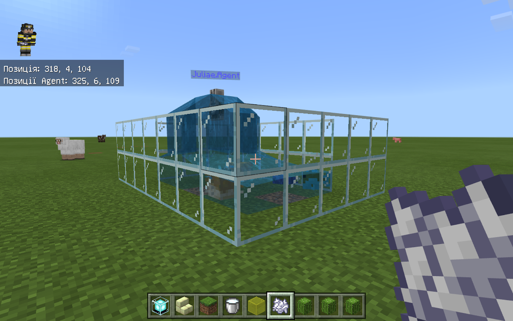

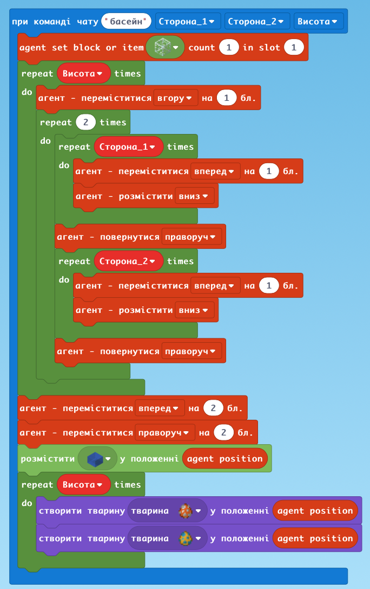
