# Заняття 15.

### Змінні. Проект ”Світлофор”

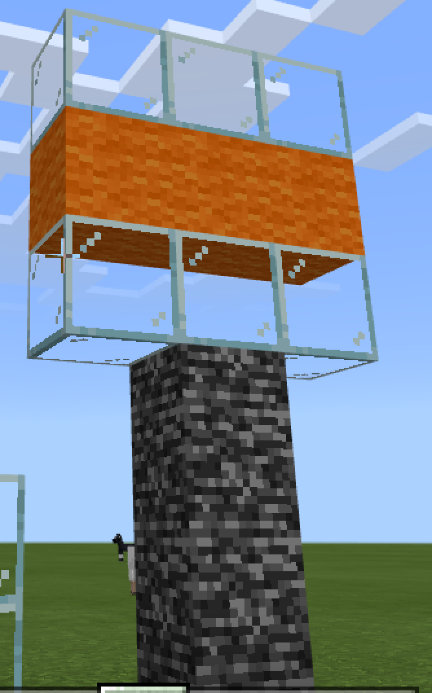

### Телепорт під землю

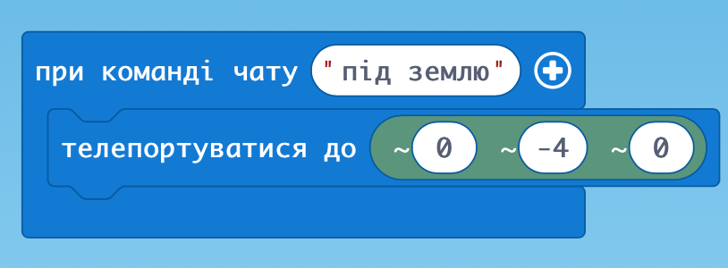

### Руйнування

Очистимо біля себе територію

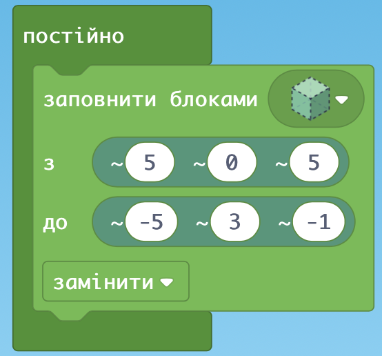

### Будуємо дах над головою

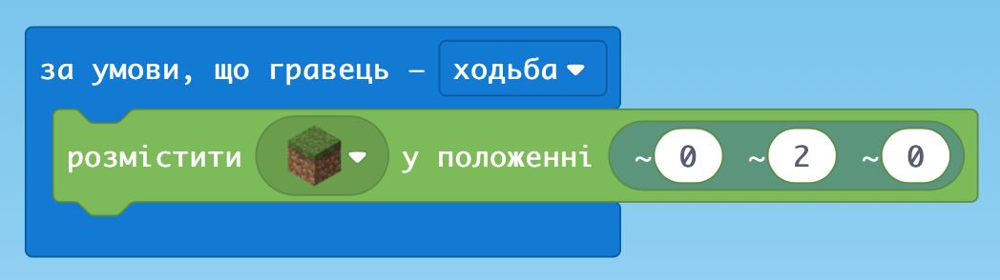

### Нога

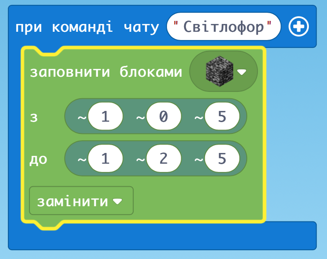

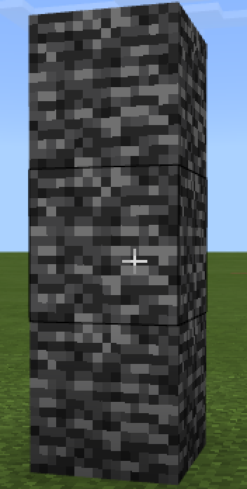

### Табло

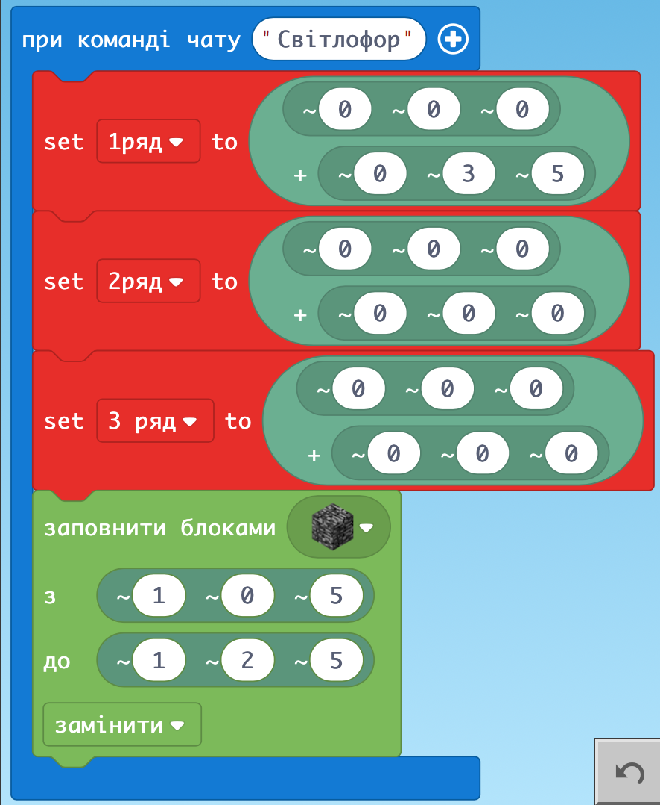

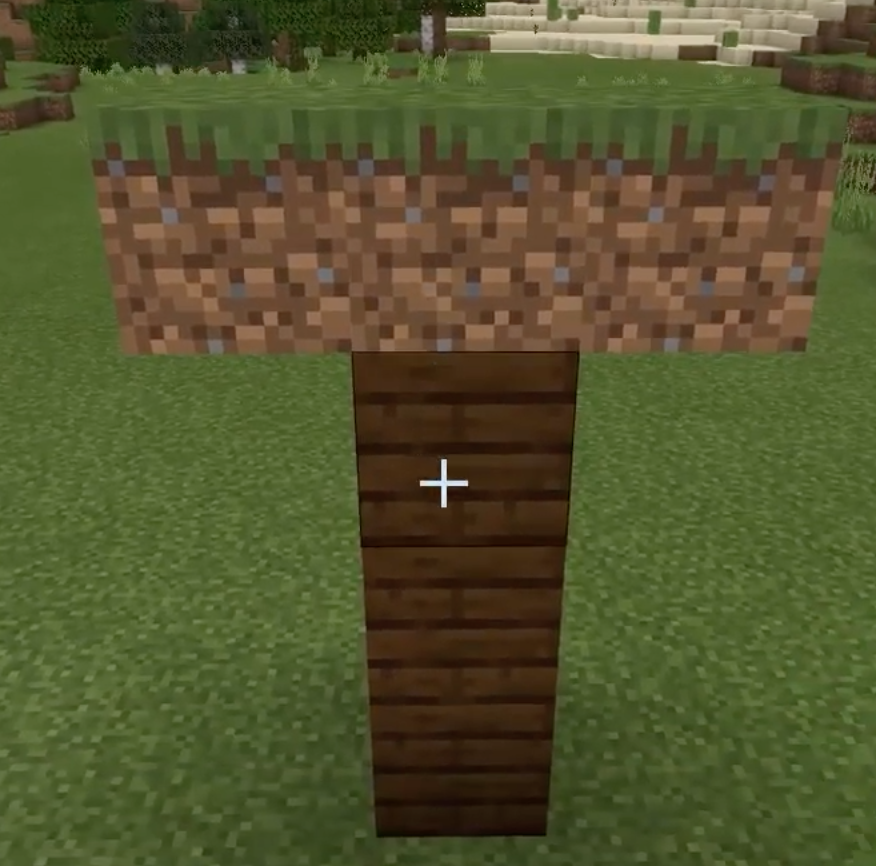

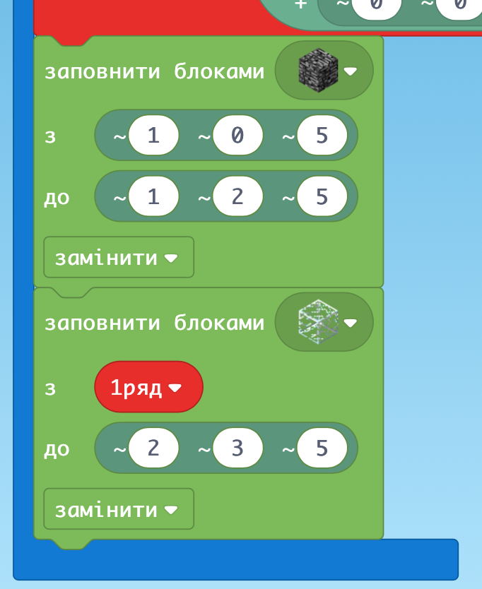

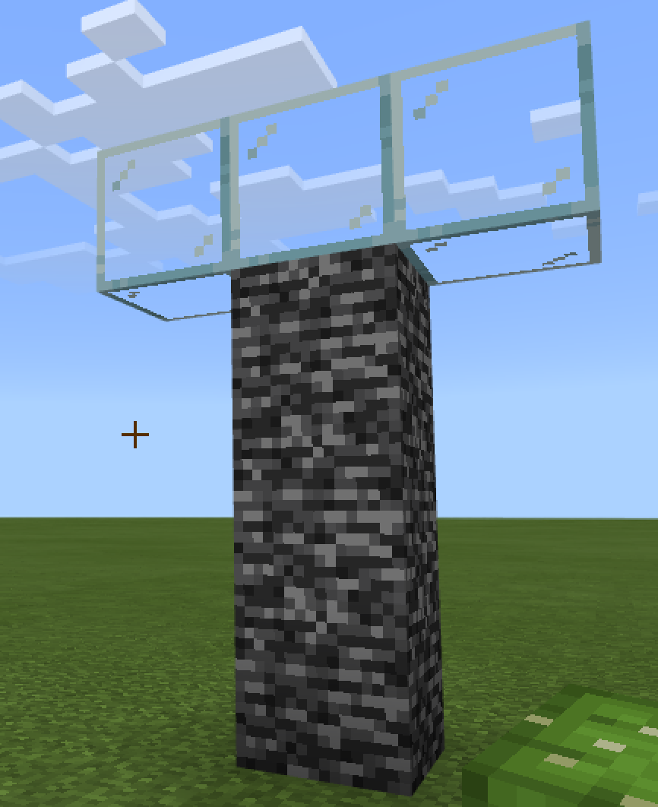

### Весь світлофор

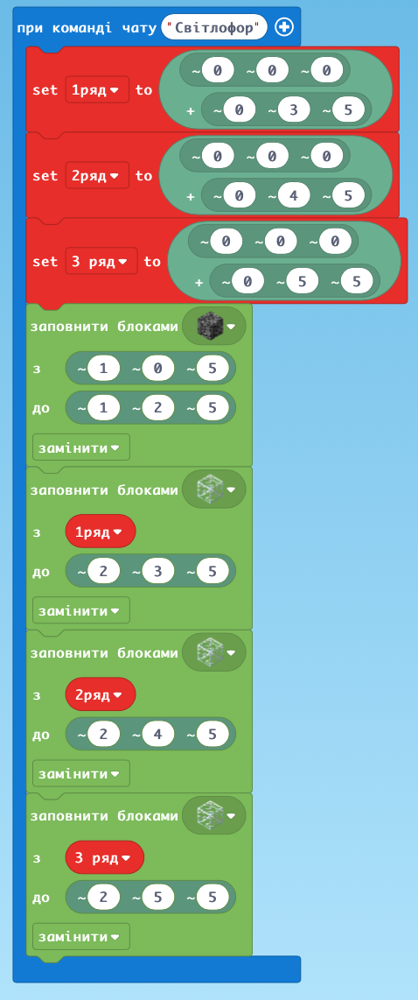

### Переходимо до світових координат:

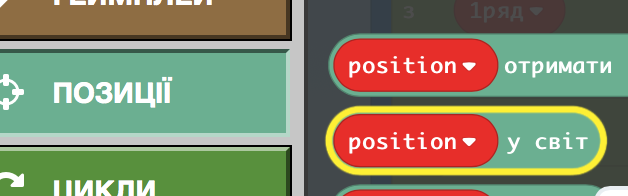

Міняємо:

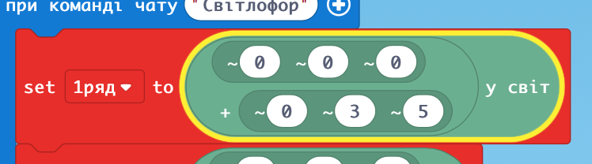

### Кольори

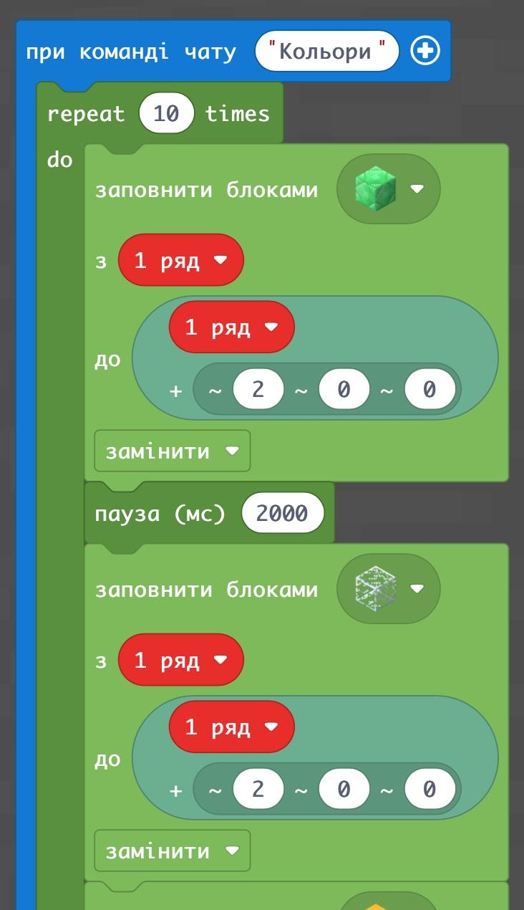

### Готові кольори

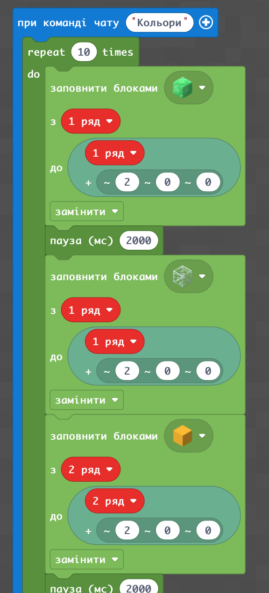

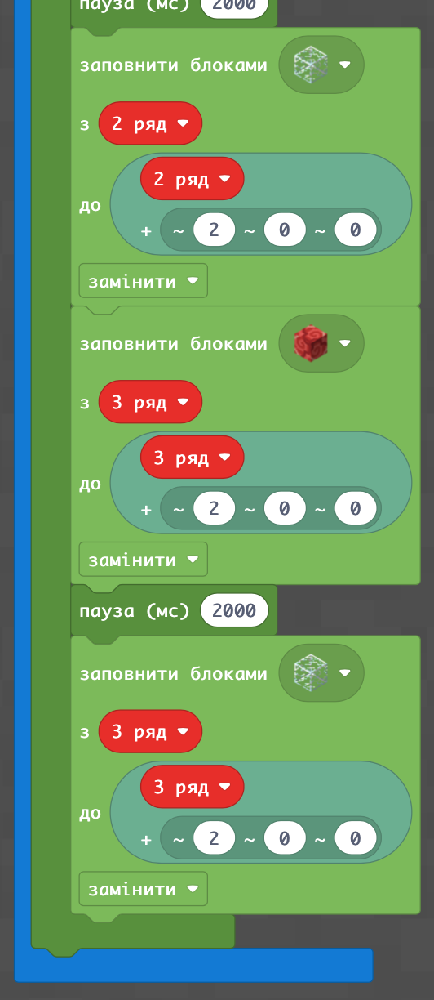

### Перевіримо чи встановлено світові координати?

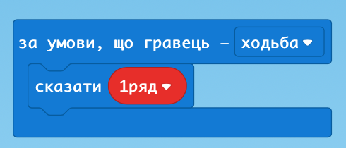

### ДЗ:

побудувати на землі пішохідний перехід кодом зі світовими координатами + позиція гравця

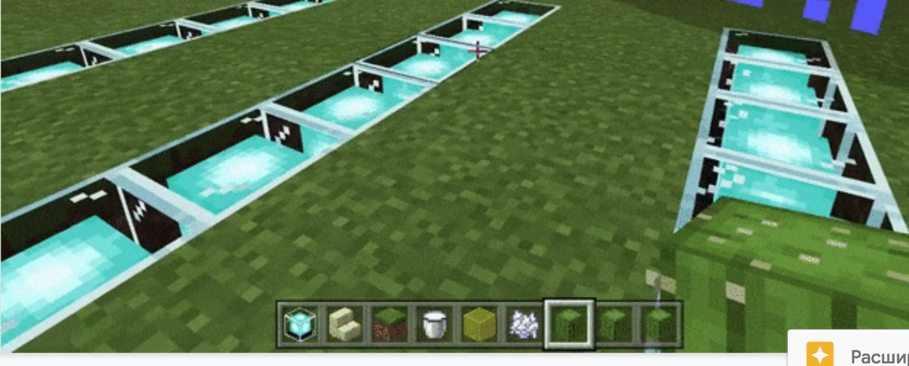
