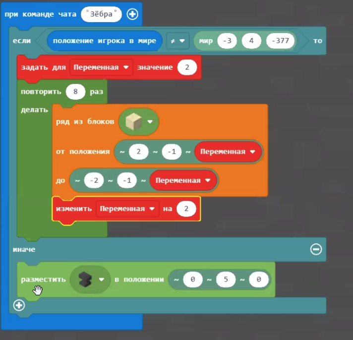
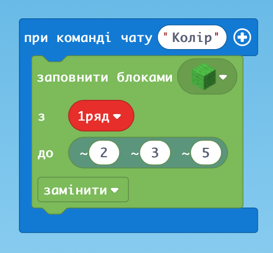
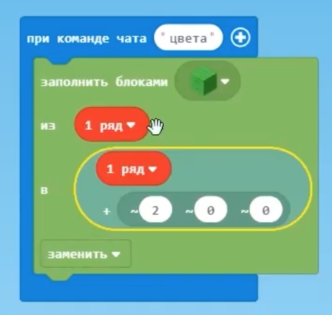
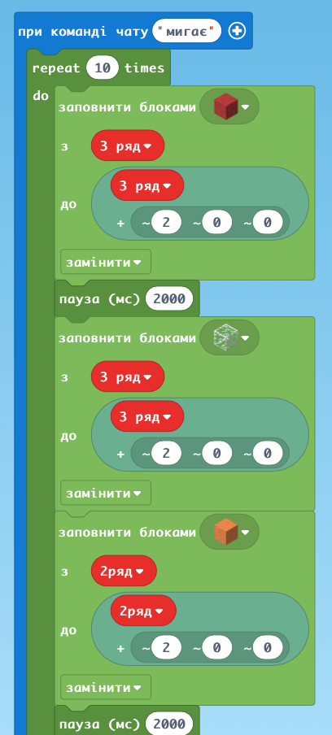
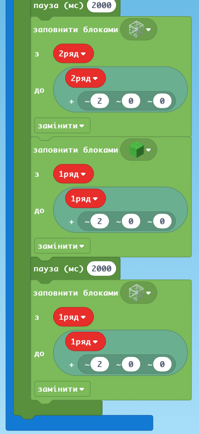
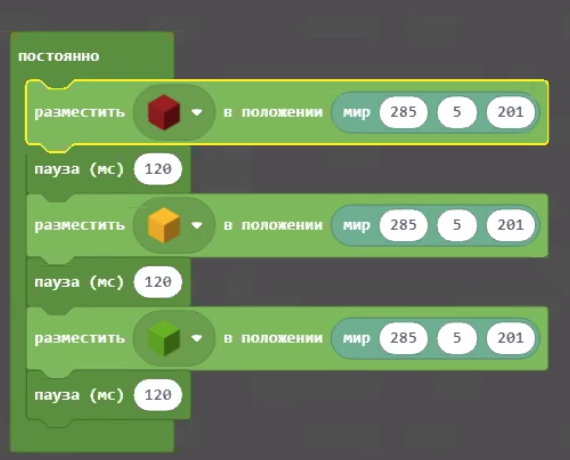
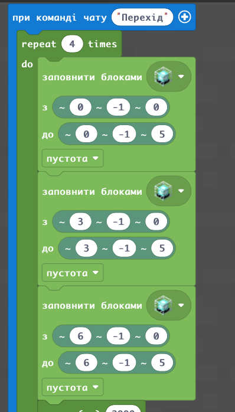
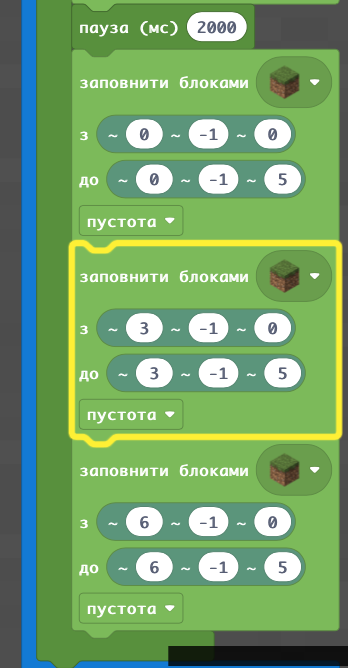
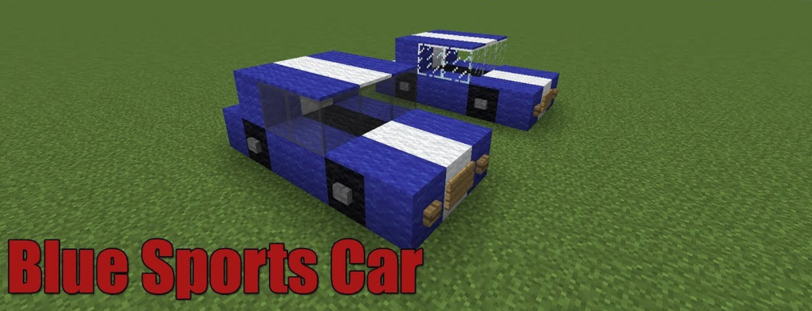

# Заняття 16.

### Зебра

### Навчаємо Світлофор змінювати кольори

тут не можна рухатися 

або

тут не залежить від гравця

### Готовий Світлофор

Перемикання кольорових блоків - заміна на інші через 2 секунди

### Світлофор Яріка

Побудувати дорогу та пішохідний перехід у якому постійно буде михтіти білі лінії

### Відповідь

### ДЗ: 
Побудова кодом автомобіля на дорозі

