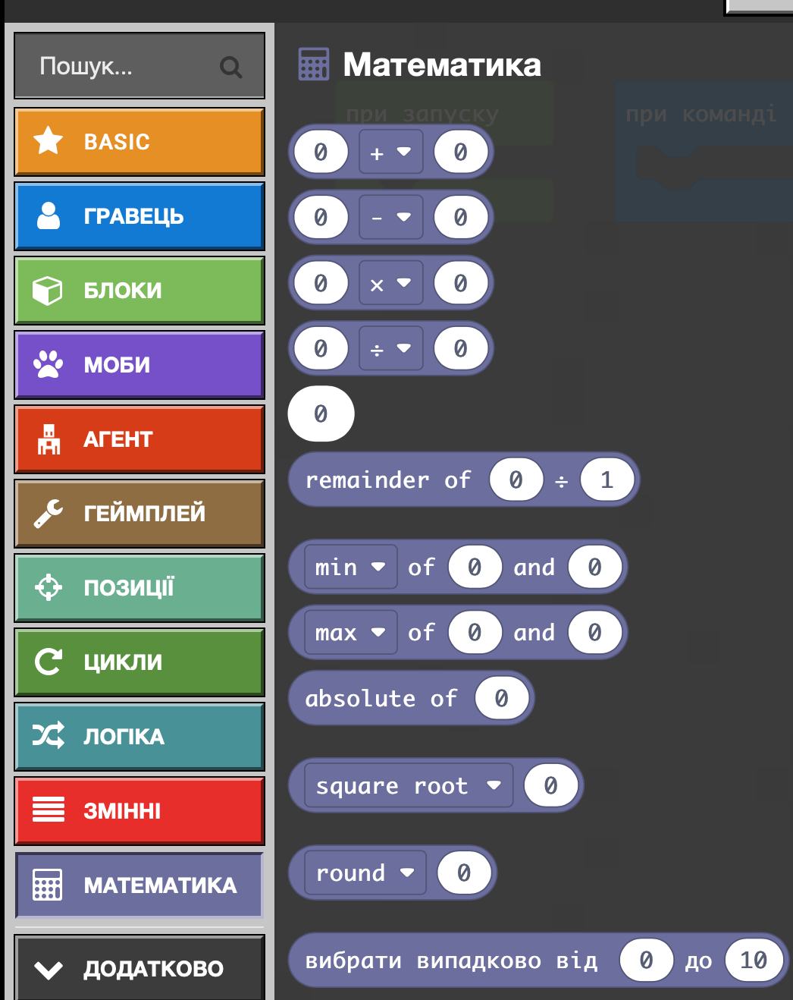
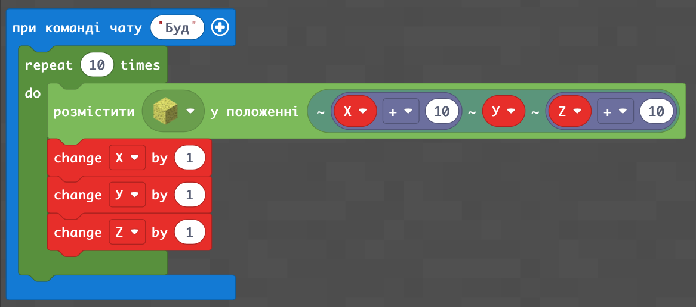
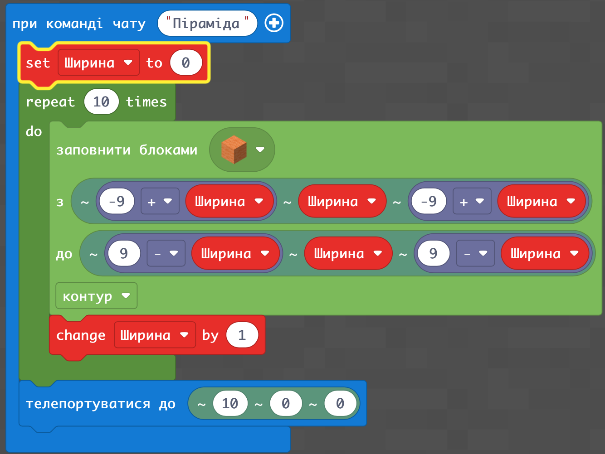
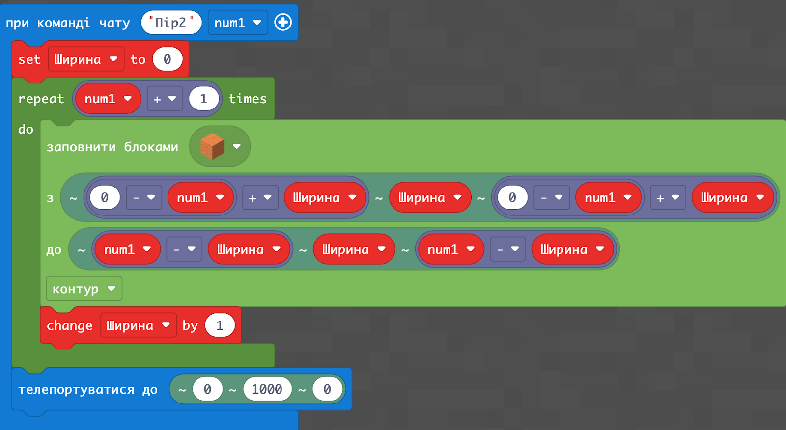
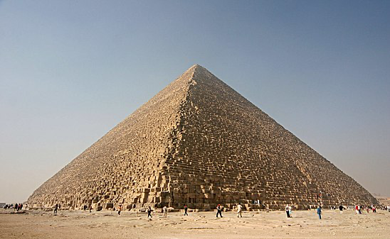

# Заняття 17. Математика

### Математика

### Сходинки

### Піраміда змінними (від Павла): математика

### Задаємо висоту піраміди

### ДЗ: 
Завдання побудувати макет Піраміди Хеопса

Якщо кількість блоків у висоту має бути 210

