# Заняття 18. 

### Конструктор

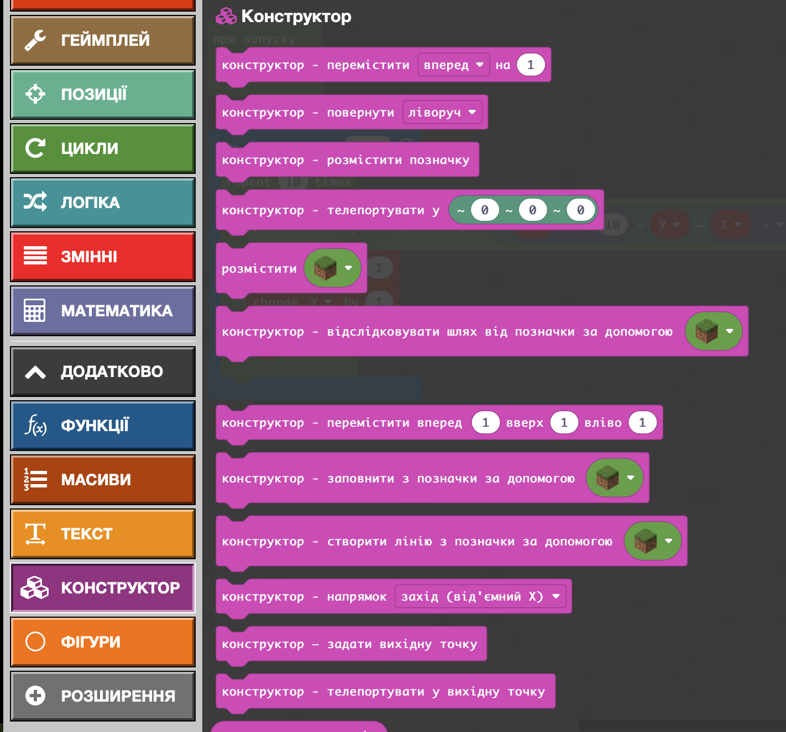

### Золоті сходи?

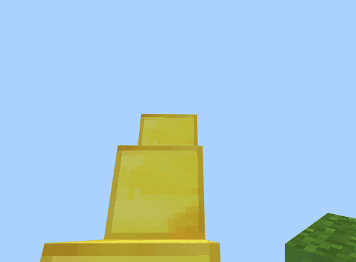

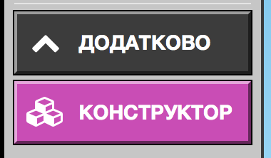

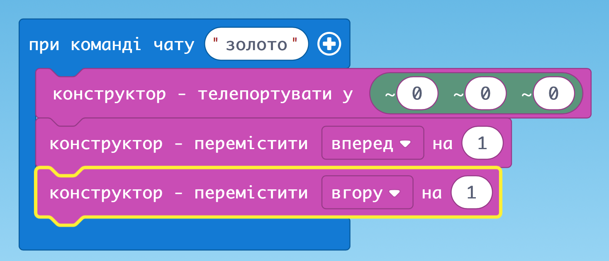

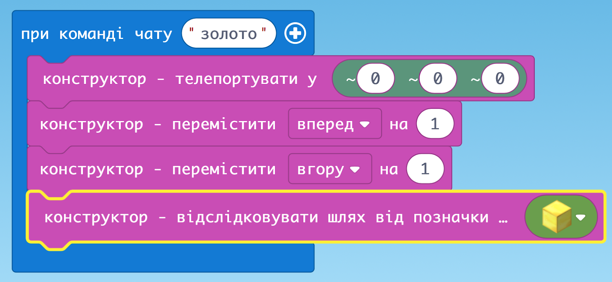

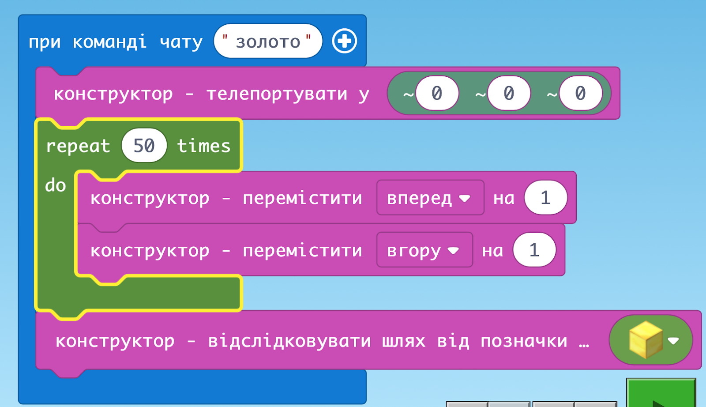

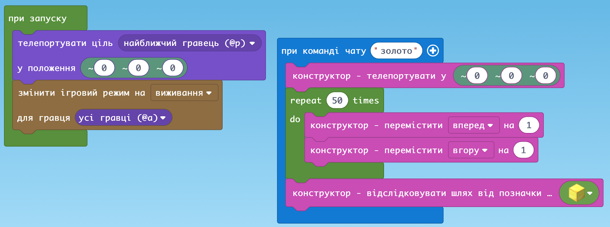

### Подвійні сходи

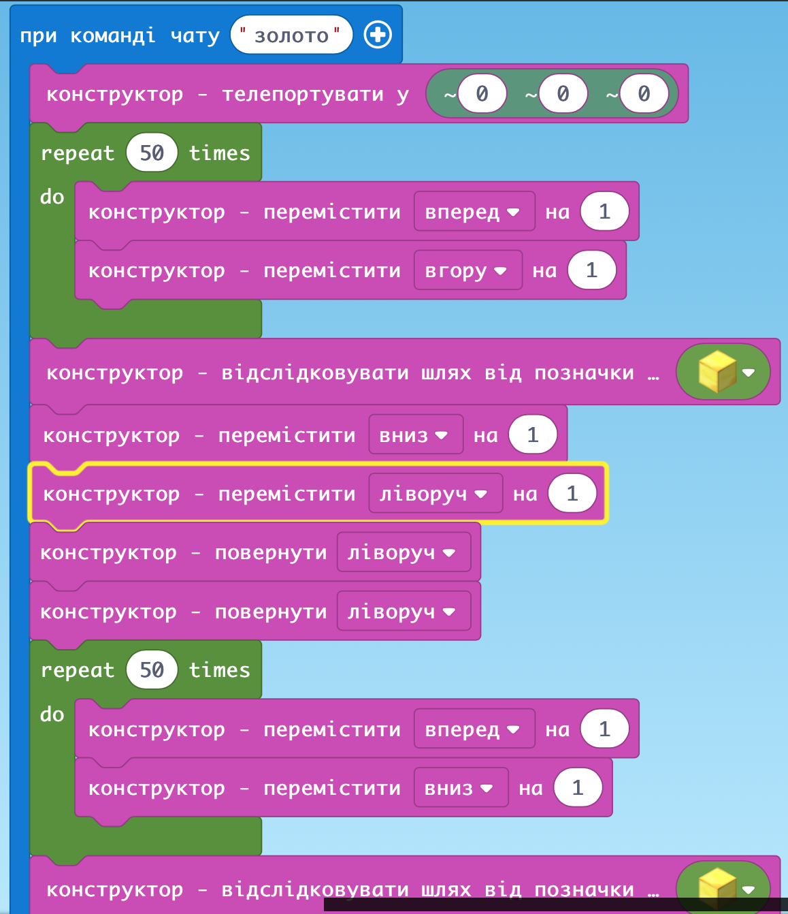

### Величезна стіна

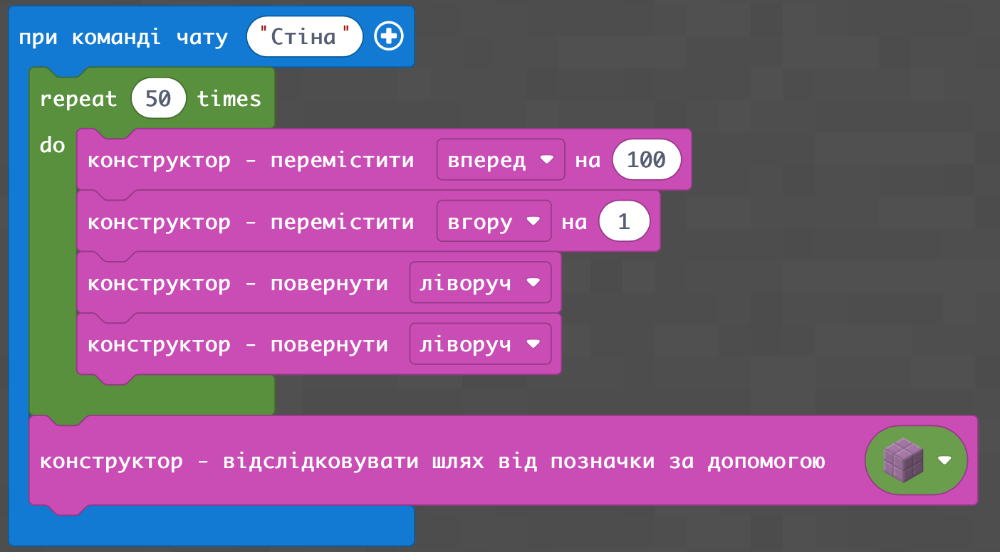

### Башта зі змінними

Використовуйте висоту блоків - непарне число!!!

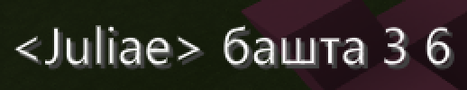

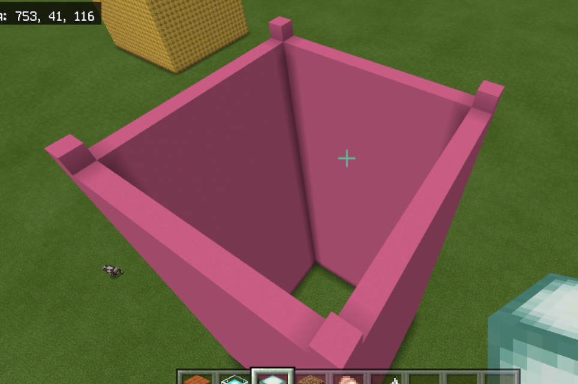

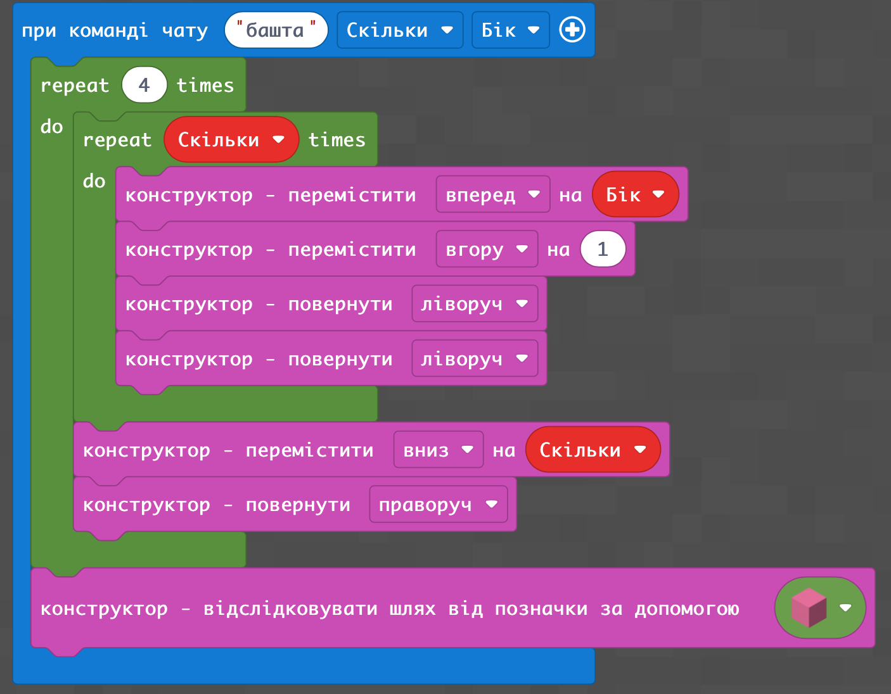

### ДЗ: 
Підземна скляна лабораторія з білим ведмедем, що підсвічує вхід ліхтарем

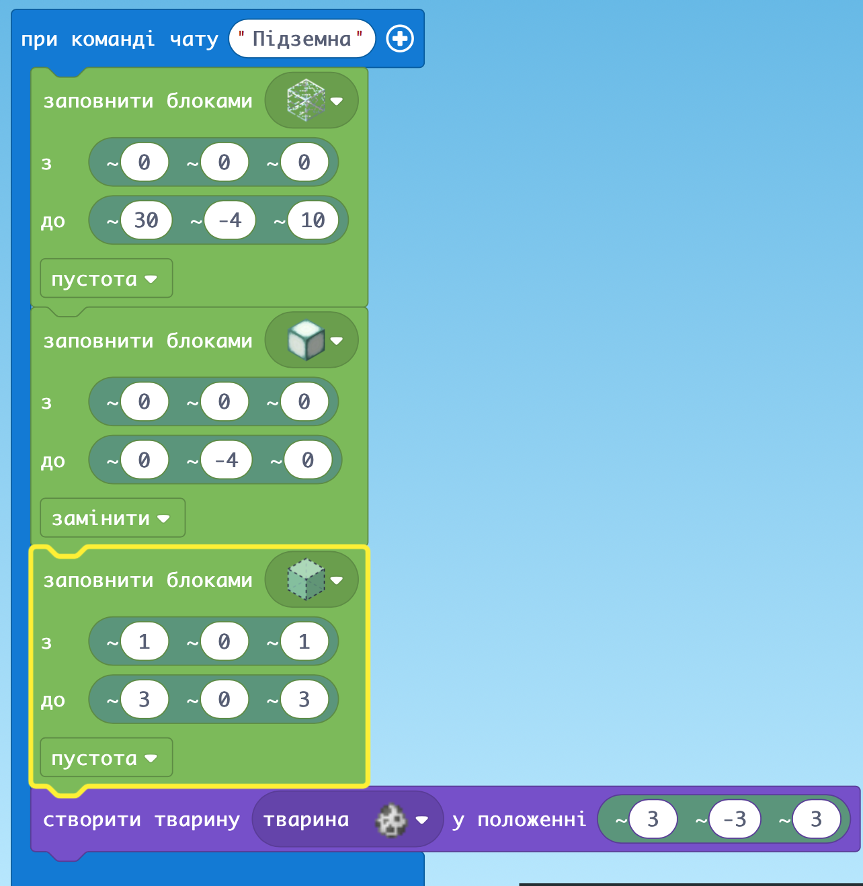
