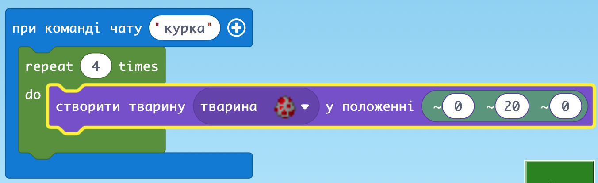
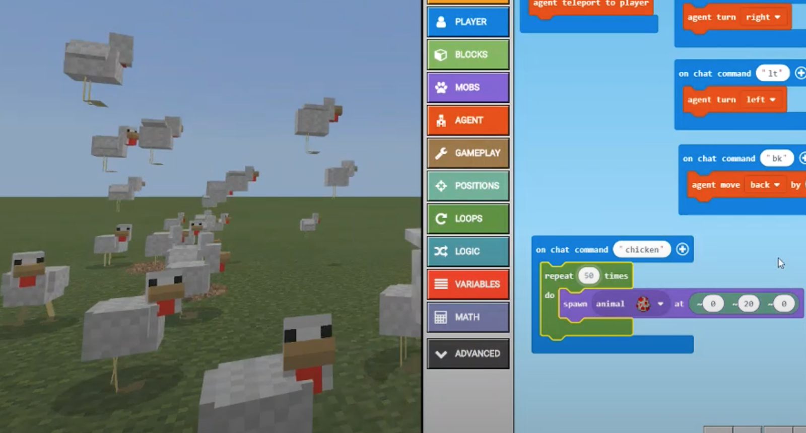
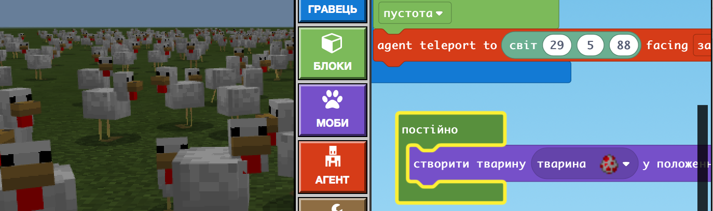
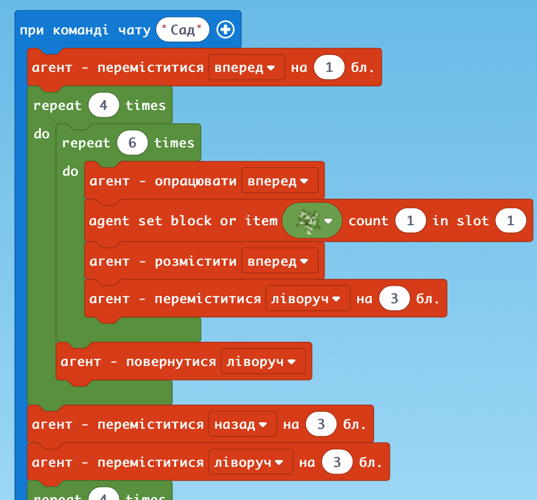
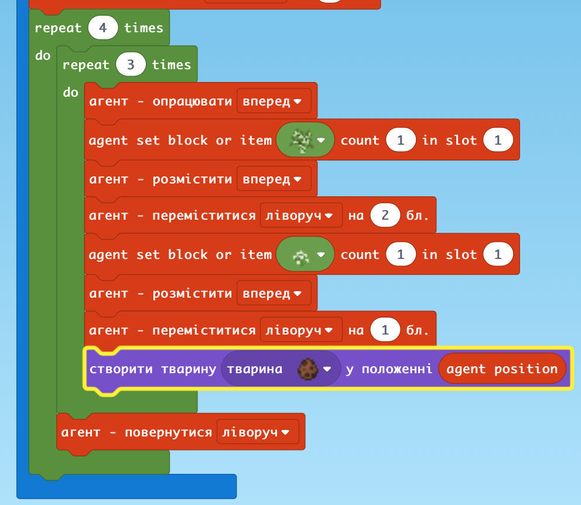
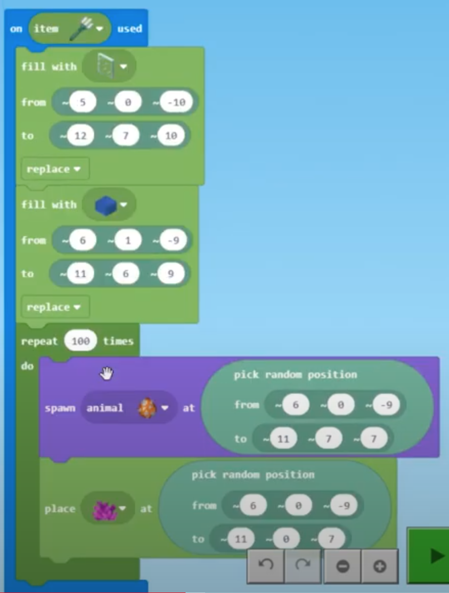
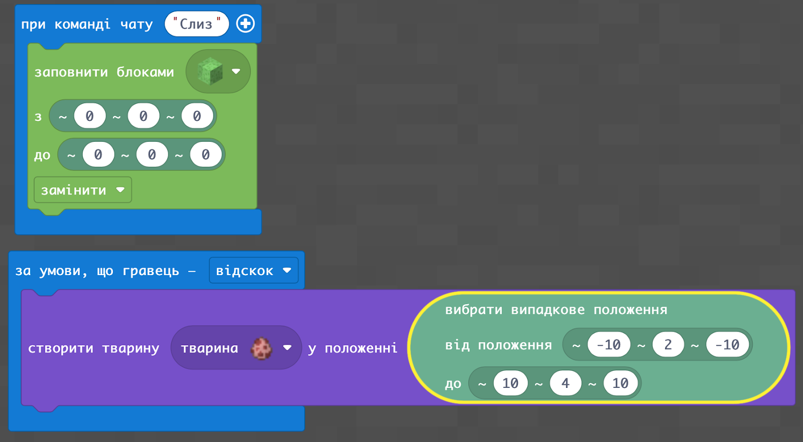

# Заняття 9. Створення мобів

### Створення Мобів: згори прилітають кури

### Багато

### Завдання: через код посадити сад та позмістити там різних тварин

### Доповнюємо Акваріум рибками

### Створіть слиз, постибайте на ньому щоб утворилася свинка

### ДЗ: 
через код побудувати огорожу по периметру і запустити туди курей
