# ИСТОРИЯ КОМПЬЮТЕРНОЙ ГРАФИКИ

История дизайна начинается задолго до создания интернета, и определить точку отсчета достаточно сложно.

*Кого считать первыми дизайнерами?*

 Первобытных людей в грязных шкурах с дубинами в руках оставляющих наскальные живописи? Однако именно появление орудий труда, развило потребность сделать эти орудия более удобными, красивыми и функциональными. Уже в античные времена в филосовских дискуссия затрагивается тема пользы и красоты создоваемого. 

*Слово дизайн пришло к нам из итальянского языка и в переводе имеет множество значений.*

 "Disegno" с итальянского языка переводиться как замысел, план, намерение, цель, чертеж, эскиз, набросок, рисунок, узор, модель, шаблон, лежащая в основе схема, композиция.

 Ежегодно 3 декабря отмечается Всемирный день компьютерной графики. Дата выбрана не просто так: этот день в англоязычном варианте - 3 December, то есть получается единственное в своем роде ключевое сочетание - 3December, или 3D.

 В середине прошлого века компьютеры были не просто большими, а огромными, и драгоценное машинное время мейнфреймов использовалось исключительно для военных и промышленных нужд. Однако кому-то из заскучавших программистов пришла в голову идея эксплуатации печатающих устройств для вывода картинок и фотографий. Все просто: разница в плотности алфавитно-цифровых знаков вполне пригодна для создания изображений на бумаге - пусть даже они и получаются мозаичными, но вполне себе приемлемы для восприятия зрением на расстоянии.

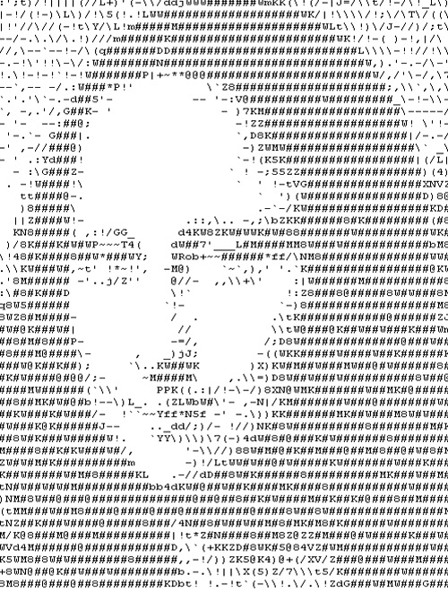

Дизайн можно разделить на следующие виды:
 - Дизайн интерьера
 - Промышленный дизайн 
 - Графический дизайн
 - Экологический дизайн 
 - Арт - дизайн 
 - Дизайн одежды
 - Фитодизайн 
 - Дизайн среды

 ### Фитодизайн 
 Представляет собой как составление отдельных объемных или плоских композиций из живых или засушенных цветов и растений, так и целостное оформление интерьеров цветами, травами, деревьями, корягами и т. п.

 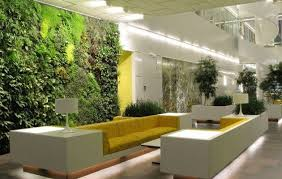

### Промышленный дизайн 
 Это конструирование станков, транспортных средств, бытовых приборов, посуды, мебели и многого другого

 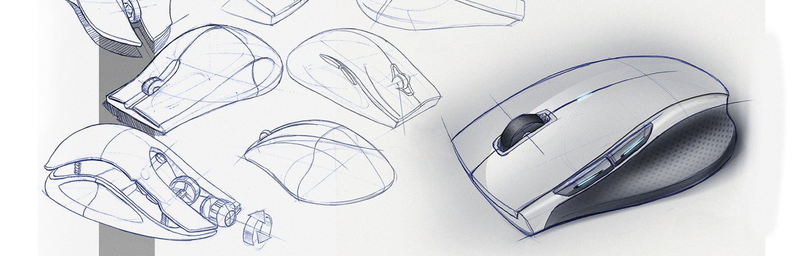 

 ### Дизайн среды 
 Это искусство проектирования интерьеров, экстерьеров

  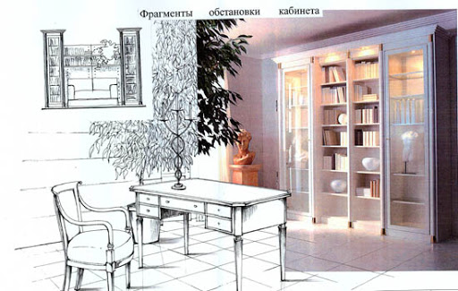

 ### Графический дизайн 
 Это процесс визуального общения и решения проблем с использованием типографики, фотографии и иллюстрации.
*Виды:*
- шрифты 
- полиграфия 
- веб-дизайн
- товарные знаки 
- мобильный дизайн

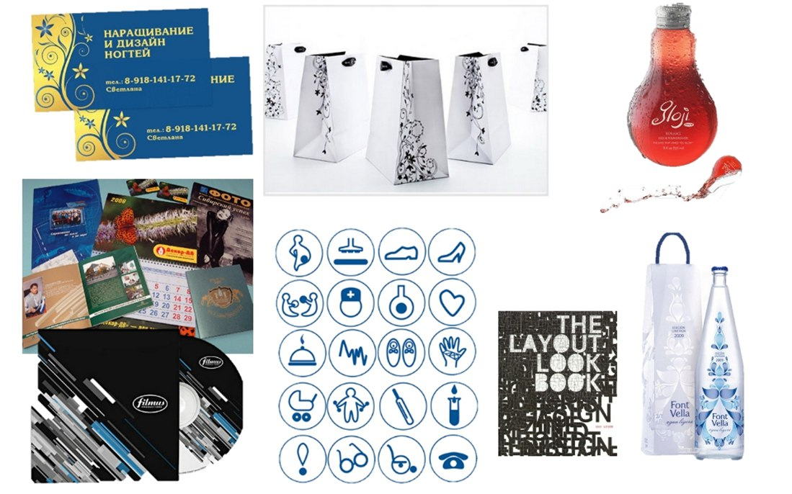 

### Ландшафтный дизайн 
Это практические действия по озеленению, благоустройству, организации садово-парковых насаждений, газонов, горок, применению малых архитектурных форм в зелёном строительстве.

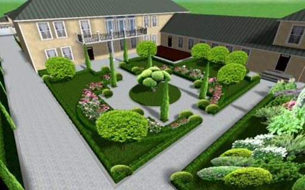 

### Архитектурный дизайн 
Это массовое строительство (общественные жилища и производственные здания), инженерные сооружения Архитектурный дизайн

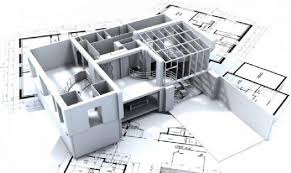 

### Арт-дизайн 
Является искусством проектирования таких объектов, которые не имеют прямого функционального назначения, но отвечают высоким требованиям, предъявляемым к произведениям искусства.

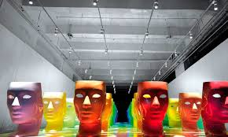  

### Искусство макияжа
В создании прекрасного облика человека участвует визажист — дизайнер и архитектор лица. 

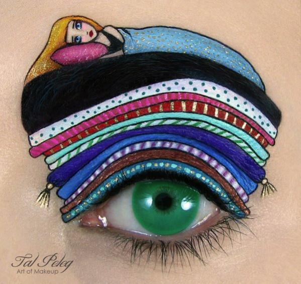 

### Дизайн одежды
Включает ее моделирование и конструирование.

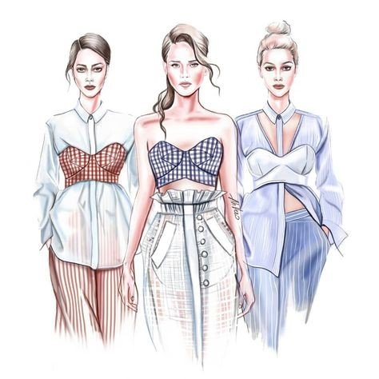 

### Экологический дизайн 
Решает проблему благотворного влияния на людей проектируемой и создаваемой окружающей среды.

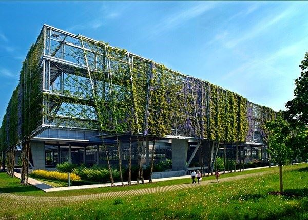 

## Векторная и растровая графика.

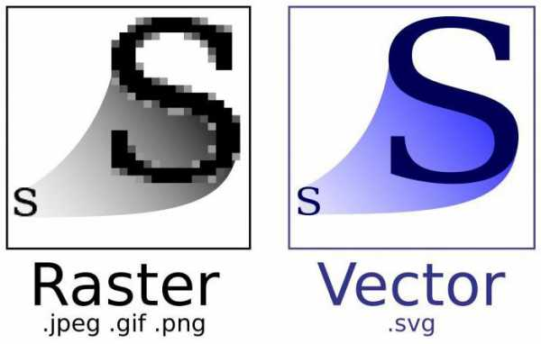 

**Растровая графика.**
Особенность растрового изображения в том, что оно, как мозаика, складывается из маленьких ячейчатых кусочков – пикселей. И чем выше разрешение, тем большее количество пикселей умещается на единицу площади. Растровые изображения используют для передачи плавного перехода цветов, множества оттенков. 

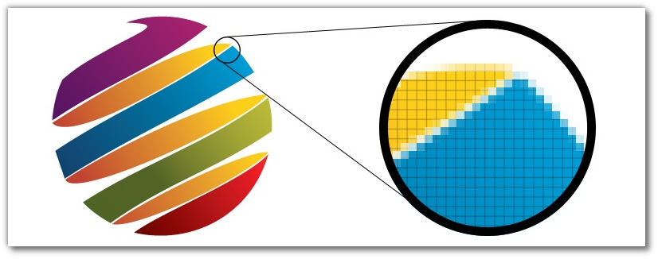 

**Векторная графика.**
В отличии от растрового изображения, векторное не состоит из отдельных точек – пикселей. В векторных графических объектах существуют, так называемые, опорные точки, между ними – кривые. Кривизна этих кривых описывается математической формулой. Векторная графика применяется зачастую в полиграфии: буклеты, листовки, визитки и пр. Т.е. продукты, в которых есть текст, логотип, узоры-орнаменты, — все, что не требует точной передачи всех 18 оттенков персикового цвета, и может быть описано с помощью кривых. 

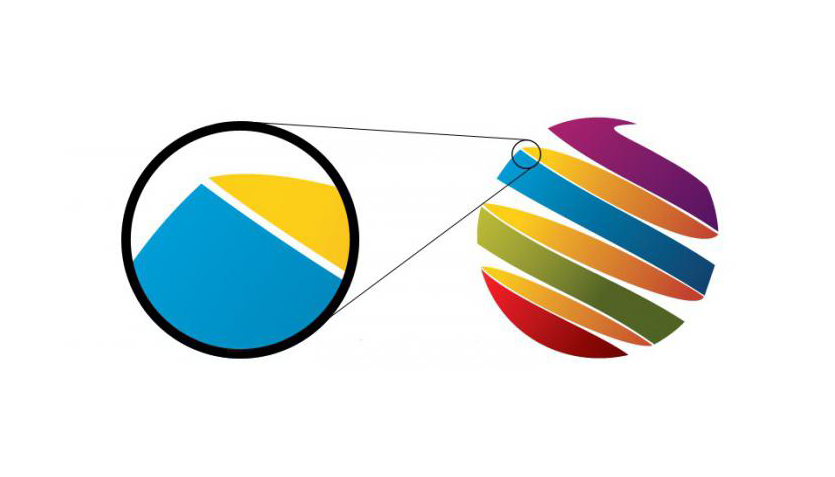 

**Растровое изображение:**

*Плюсы:*
- очень четко и тонко передает изменение-перетекание цветов, оттенки, тени.

*Минусы:*
- потеря качества при увеличении: картинка рассыпается в цветные квадратики – пиксели;
- в большом разрешении занимает очень много места.
*Сфера применения:*
- обработка фотографий
- создание макетов сайтов
- создание графических объектов с большой цветовой гаммой 
      
*Adobe Photoshop*

**Векторное изображение:**

*Плюсы:*
- легко масштабировать — изображение не теряет качество даже при очень большом увеличении.

*Минусы:*
- невозможно передать плавные цветовые переходы, как в растре.

*Сфера применения:*
- полиграфия
- дизайн листовок
- буклетов
- рекламных материалов
- визиток
- логотипов и пр.

*Adobe Illustrator*

# Что такое Adobe Photoshop 

 

**Adobe Photoshop** - многофункциональный графический редактор, разработанный и распространяемый фирмой Adobe Systems. Продукт является лидером рынка в области коммерческих средств редактирования растровых изображений, и наиболее известным продуктом фирмы Adobe. 

### Особенности

- Несмотря на то, что изначально программа была разработана как редактор изображений для полиграфии, в данное время она широко используется и в веб-дизайне.

- Photoshop тесно связан с другими программами для обработки медиафайлов, анимации и другого творчества. 

### Возможности Adobe Photoshop

- Обработка цифровых и отсканированных фотоснимков, цветокоррекция, спецэффекты, устранение различных дефектов съемки.

- Возможность создания многослойного изображения. При этом каждый элемент иллюстрации может быть сохранен в собственном, отдельном слое, который может редактироваться отдельно, перемещаться относительно других слоев и т.д.

- Фотомонтаж, составление коллажей.

- Ретуширование и восстановление старых фотографий.

- Обработка эскизов, нарисованных вручную.

- Улучшенные инструменты для работы с текстом. Используя различные инструменты, эффекты и фильтры можно получить очень интересные эффекты.

- Создание текстур для 3D моделей.

- Создание графических элементов дизайна и оформления для сайтов, документов, печати и полиграфии .

- Подготовка изображений к печати или публикации в Интернете.

- Поддержка различных стандартов изображения (RGB, CMYK, Grayscale и т.д.);

- Поддержка различных графических форматов, как растровых (BMP, JPEG, GIF), так и векторных (AI, CDR).

- Раскрашивание фотографий. 

- Можно подкрашивать участки изображения на черно-белых фотографиях.

# КОМПОЗИЦИЯ

### Основы композиции в дизайне. Что такое композиция?

**Композиция** (сочинение, составление, расположение - лат.) - объединение отдельных элементов произведения в единое художественное целое, в котором в конкретной зрительной форме наиболее ярко раскрывается содержание. Так же композицией можно назвать само произведение.

 Любой объект с легкостью можно вписать в одну из трех основных фигур: **прямоугольник, треугольник, эллипс.** Так что оперировать мы будем именно этими фигурами.	А саму композицию рассмотрим как правильное расположение элементов изображения, основанное на предметном изучении восприятия человеком зрительной информации

 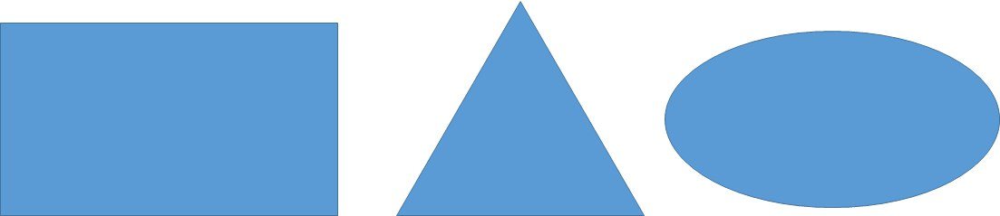 

 ### Геометрический центр

   Мы строим композицию на плоскости. Будь то фотография, лист бумаги или монитор компьютера. Если через эту плоскость провести две диагональные линии, точка их пересечения **укажет на геометрический центр** нашей будущей композиции. 

  Любой предмет, вписанный в этот центр, будет чувствовать себя вполне 
  уверенно.

   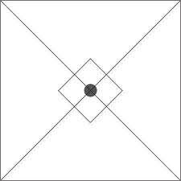 

  ### Композиционный центр

Композиционный центр служит для фокусировки внимания зрителя на деталях композиции. В фотографии, живописи и рисунке, как правило, выделяются **сюжетно-композиционные центры. То есть, в композиционном центре находится основной сюжет произведения.** В рекламе выделение композиционного центра может пригодиться для привлечения внимания потенциального покупателя к интересной ему информации. Это может быть текст или изображение.
**Композиционный центр и геометрический центр композиции могут не совпадать.Композиционных центров в композиции может быть несколько, в то время, как геометрический центр один**

  **Композиционный центр может быть выделен:**
- контрастом света и тени
- контрастом цвета
- размером
- Формой

 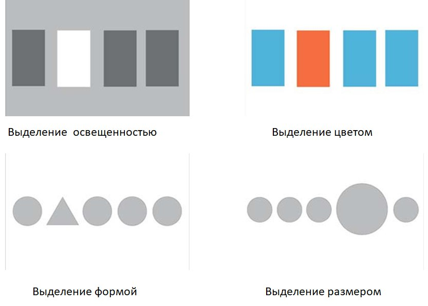 

 ### Диагональные линии в композиции

 График на рисунке слева означает рост. График на рисунке справа означает падение. И, соответственно, в композиции диагональная линия, проведенная от левого нижнего угла к правому верхнему воспринимается лучше, чем линия, проведенная от левого верхнего угла к правому нижнему.

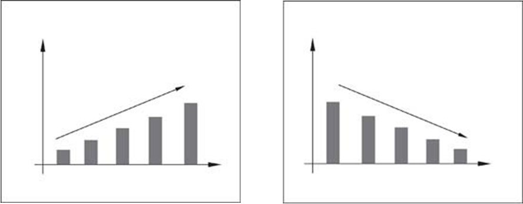 

### Замкнутая и открытая композиция

  **В замкнутой композиции основные направления линий стремятся к центру.** Такая композиция подойдет для передачи чего-то устойчивого, неподвижного.
Элементы в ней не стремятся за рамки плоскости, а как бы замыкаются в центре композиции. 
  **Открытая композиция**, в которой направления линий исходят от центра, дает нам возможность продолжить мысленно картину и увести ее за рамки плоскости. Она подходит для передачи открытого пространства, движения.

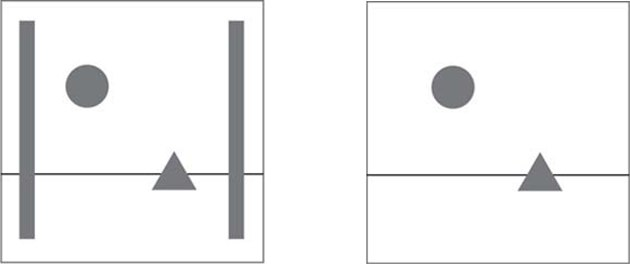 

### Правило золотого сечения

Золотое сечение можно получить, если разделить отрезок на две неравные части таким образом, чтобы **отношение всего отрезка** к **большей** части равнялось отношению **большей части отрезка к меньшей.** Это выглядит так:

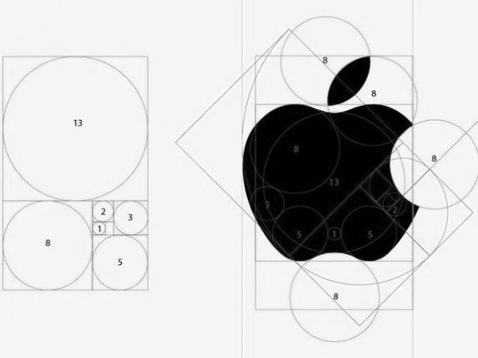 

### Правило трех третей

  В этом рисунке не соблюдено правило золотого сечения, но создается ощущение гармонии.
  Если разделить плоскость, на которой находятся наши геометрические фигуры на девять равных частей, мы увидим, что элементы расположены на точках пересечения разделяющих линий, а горизонтальная полоса совпадает с нижней разделительной линией. В этом случае действует правило трех третей. Это упрощенный вариант правила золотого сечения.

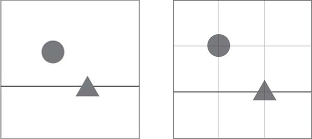 

### Динамичная  и статичная композиция 

Динамичная композиция - композиция, при которой создается впечатление движения и внутренней динамики.

  Статичная композиция (статика в композиции) - создает впечатление неподвижности.

Изображение слева выглядит статичным. На картинке справа создается иллюзия движения. Почему? Потому что мы прекрасно знаем из своего опыта, что будет с круглым предметом, если наклонить поверхность, на которой он находится. И воспринимаем этот предмет даже на картинке движущимся.

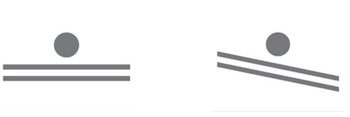 

Таким образом, для передачи движения в композиции можно использовать диагональные линии.
   Так же можно передать движение, оставив свободное пространство перед движущимся объектом, чтобы наше воображение могло продолжить это движение.

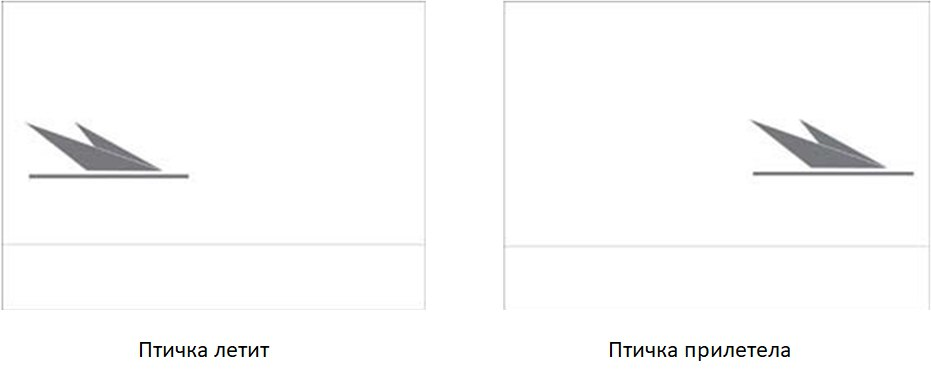 

### Симметрия в композиции

В изобразительном искусстве симметрия достигается таким расположением объектов, что одна часть композиции, как будто являются зеркальным отражением другой. Ось симметрии проходит через геометрический центр.

 Симметричная композиция служит для передачи покоя, устойчивости, надежности, иногда, величества.

### Асимметрия в композиции

   Асимметрия - это отсутствие или нарушение симметрии. Но это вовсе не значит, что асимметрия – это отсутствие равновесия композиции.
   Асимметричное равновесие достигается тогда, когда элементы композиции, находящиеся по разные стороны от центра, имеют одинаковую визуальную массу. Достичь равновесия при помощи асимметрии сложнее, чем в симметричной композиции, так как между композиционными элементами более сложные пространственные отношения. Асимметричное равновесие более динамичное и интересное для привлечения внимания, чем симметричное.

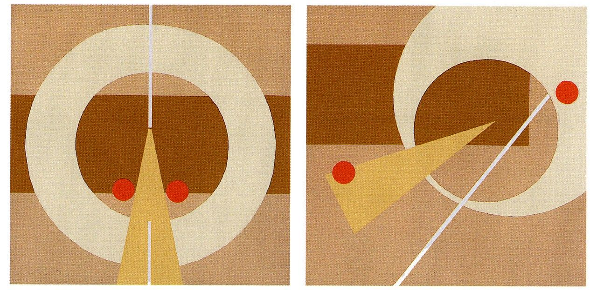 

### Как пользоваться правилами композиции

Правила композиции не являются обязательными для соблюдения. Даже наоборот. 

   Если лицо человека на картине повернуто в какую-либо сторону, необходимо оставлять свободное пространство с этой стороны, чтобы взгляд не упирался в преграду. Валентин Серов в портрете Ермоловой нарушает это правило композиции, в результате чего создается впечатление, будто актриса смотрит на нас прямо с полотна.

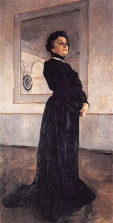 

