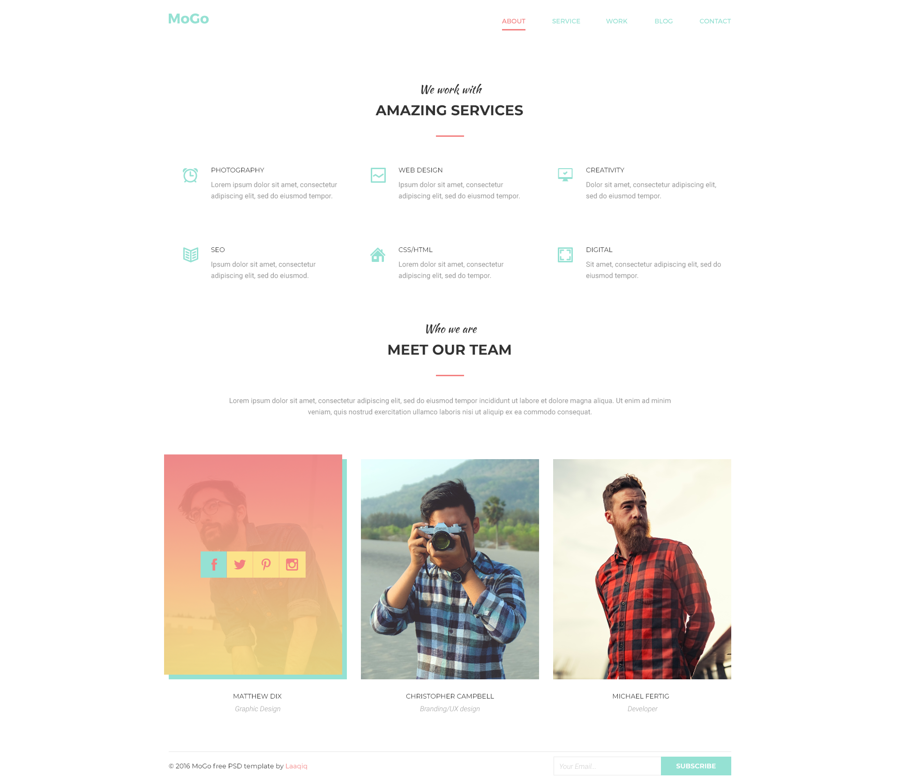

# Домашні завдання
## Модуль 1. Верстка сторінки HTML

<a href = "./psd/homework-01.psd">Проект в форматі PSD</a>

## Модуль 2. Завантаження завдання №1 на GitHub

## Модуль 3. Верстка сторінки HTML+CSS. inline-blocks.

<a href = "./psd/homework-03.psd">Проект в форматі PSD</a>

## Модуль 4. Верстка сторінки HTML+CSS. FlexBox.

<a href = "./psd/homework-04.psd">Проект в форматі PSD</a>

## Модуль 5. Позиціювання.

<a href = "./psd/homework-05.psd">Проект в форматі PSD</a>

## Модуль 6. Форми.

<a href = "./psd/homework-07.psd">Проект в форматі PSD</a>

## Модуль 7. Адаптивний дизайн.
### Мобільна верстка
  
  
<a href = "./psd/homework-08-Mobile.psd">Проект в форматі PSD</a>
  
### Верстка для планшету
  

<a href = "./psd/homework-08-Tablet.psd">Проект в форматі PSD</a>  
  
### Верстка для десктопу
  
  
<a href = "./psd/homework-08-Desktop.psd">Проект в форматі PSD</a>
