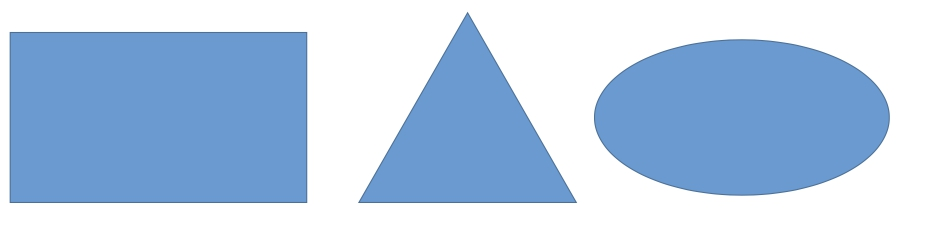
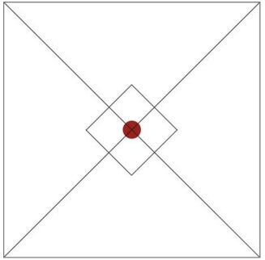

## Основы композиции в дизайне

**Композиция** (сочинение, составление, расположение - лат.) - объединение отдельных элементов произведения в единое художественное целое, в котором в конкретной зрительной форме наиболее ярко раскрывается содержание. Так же композицией можно назвать само произведение.  

Любой объект с легкостью можно вписать в одну из трех основных фигур: прямоугольник, треугольник, эллипс. Так что оперировать мы будем именно этими фигурами.	А саму композицию рассмотрим как правильное расположение элементов изображения, основанное на предметном изучении восприятия человеком зрительной информации

### Геометрический центр

Мы строим композицию на плоскости. Будь то фотография, лист бумаги или монитор компьютера. Если через эту плоскость провести две диагональные линии, точка их пересечения **укажет на геометрический центр** нашей будущей композиции. 

  Любой предмет, вписанный в этот центр, будет чувствовать себя вполне уверенно.

### Композиционный центр

**Композиционный центр** служит для фокусировки внимания зрителя на деталях композиции. В фотографии, живописи и рисунке, как правило, выделяются **сюжетно-композиционные центры**. **То есть, в композиционном центре находится основной сюжет произведения**. В рекламе выделение композиционного центра может пригодиться для привлечения внимания потенциального покупателя к интересной ему информации. Это может быть текст или изображение.
Композиционный центр и геометрический центр композиции могут не совпадать.
**Композиционных центров в композиции может быть несколько, в то время, как геометрический центр один.**

**Композиционный центр может быть выделен:**
* контрастом света и тени
* контрастом цвета
* размером
* Формой
