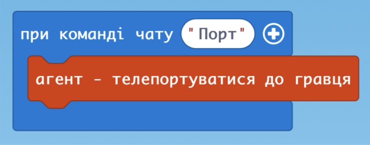

## Заняття 2. Управіння агентом
Агент - це особливий персонаж в Minecraft Education. За допомогою блоку коду, що відкрівається при натисканні клавіши "с" (code), ми можемо писати програми, які агент буде виконувати.
### Телепортація до гравця
Агент за замовчуванням може знакходитися в будь-якій точци світу. Для того, щоб було зрозуміло, як агент виконує отримані завдання важлво, щоб він знаходився поруч із гравцем. Для того, щоб агент виконав вказані команди необхідно обрати дію гравця, за умови виконання якої агент буде виконувати завдання.

В наведеному вище прикладі такою подією є команда чату "Порт".  
Тобто для реалізациї даної команди необхідно відкрити чат (натиснути клавішу "t") та ввести слово "Порт".