# Заняття 11. Ферма панд

### Ферма панд

Із світлового каменю з травою і бамбуком

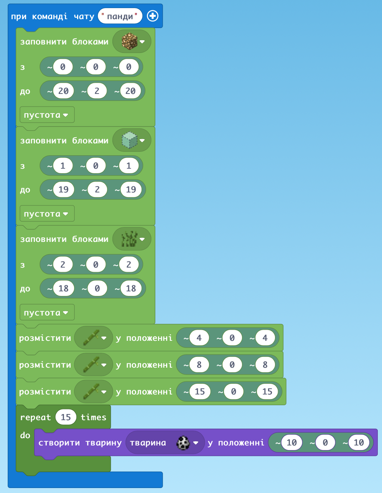

### Створення вежі методом охолодження лави

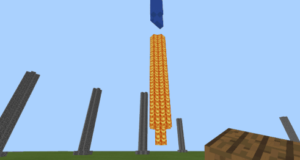

### Лава

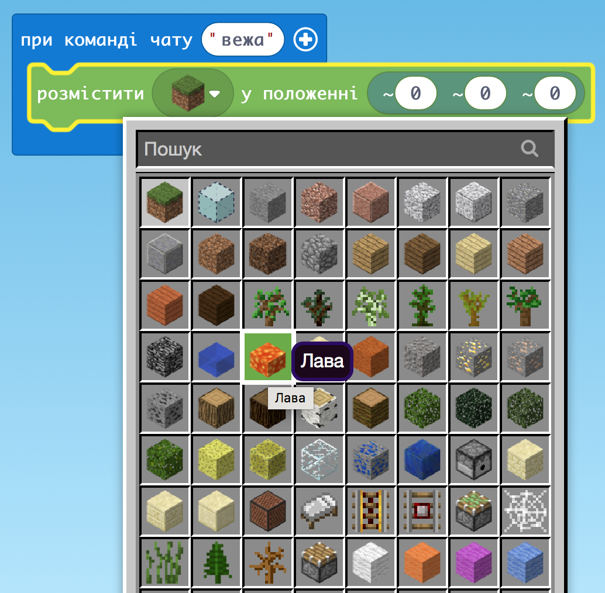

### Вода

Для гасіння

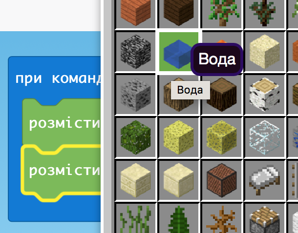

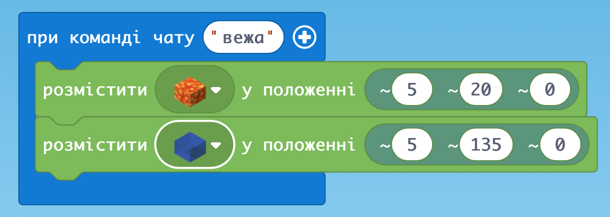

### Зупиняємо воду

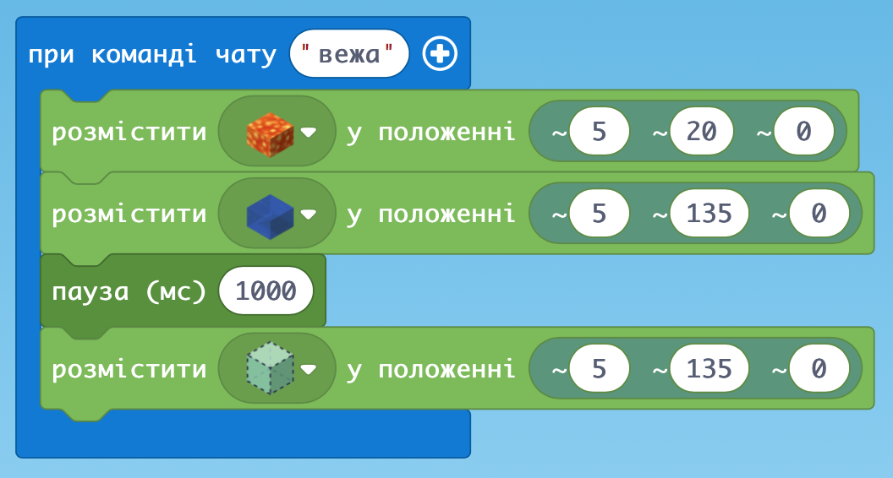

### Побудова квадрату Агентом вниз

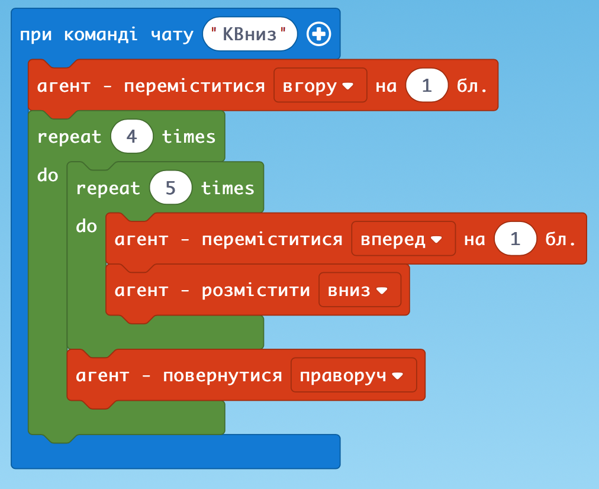

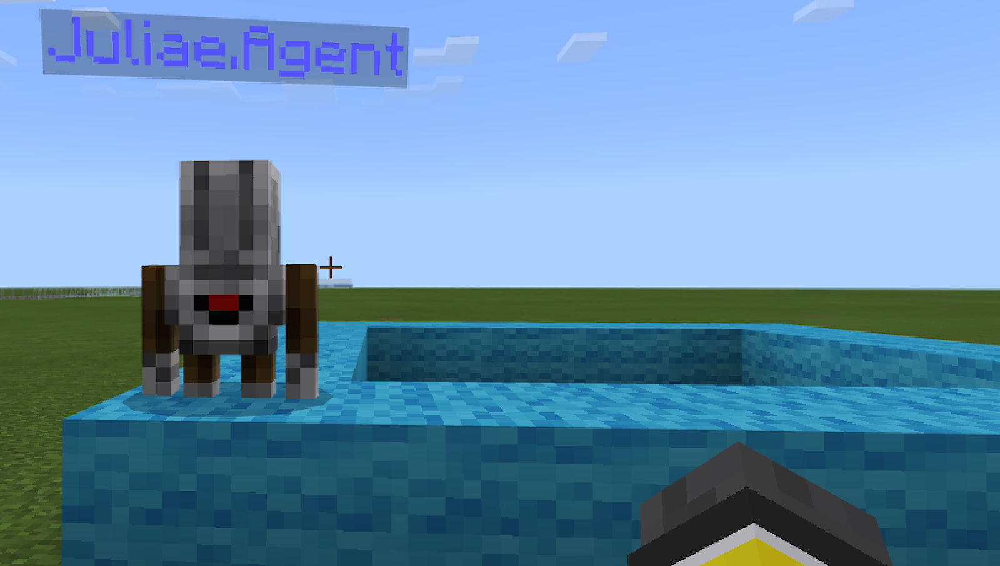

### Додаємо ще цикл, щоб кілька рівнів

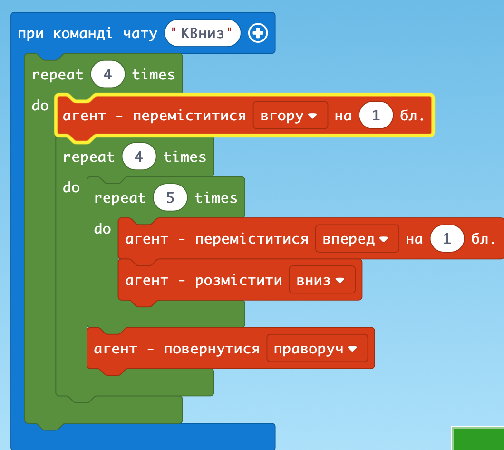

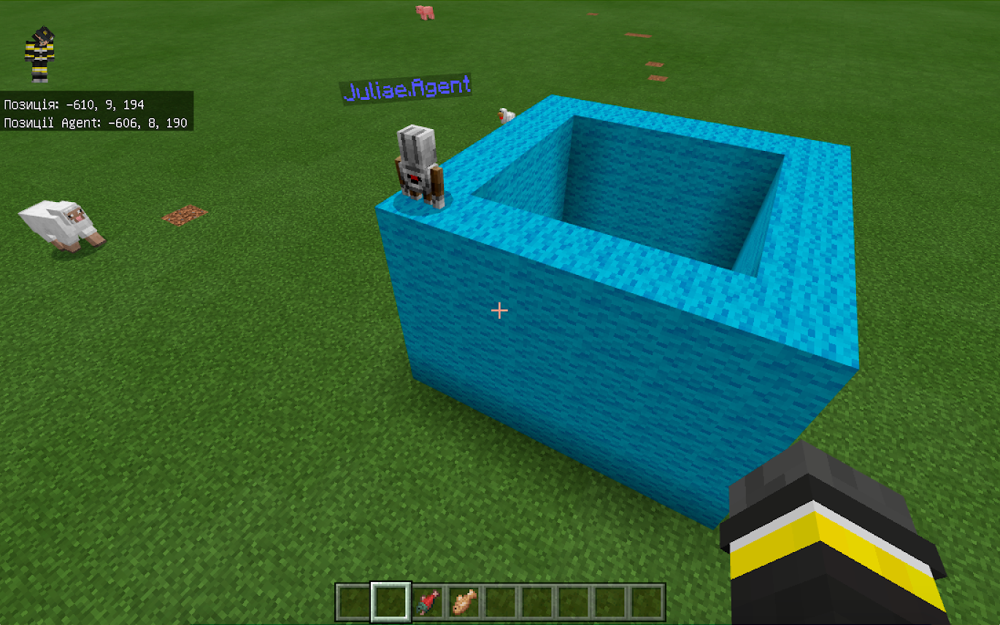

### Побудова одного шару стіни по квадрату і в окремий цикл їх кількість

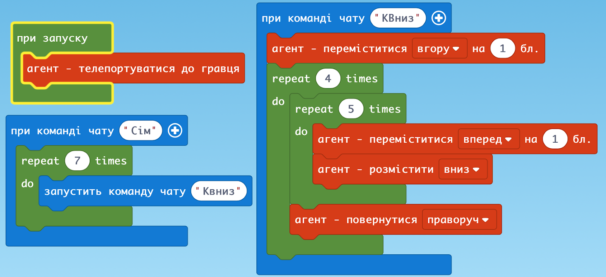

### ДЗ: 

Побудувати вежу Агентом з трьома баштами одним кодом

Вид зверху і збоку

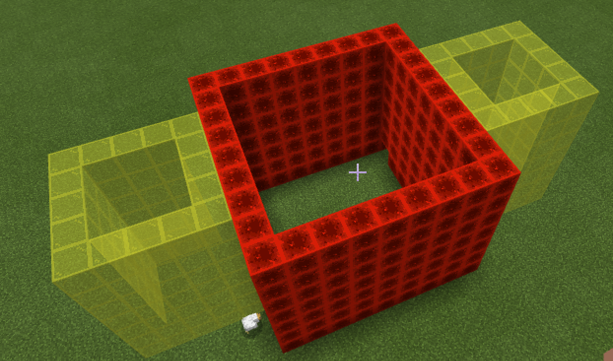

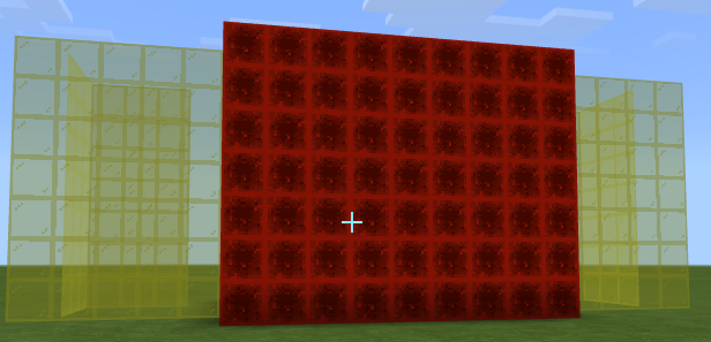
