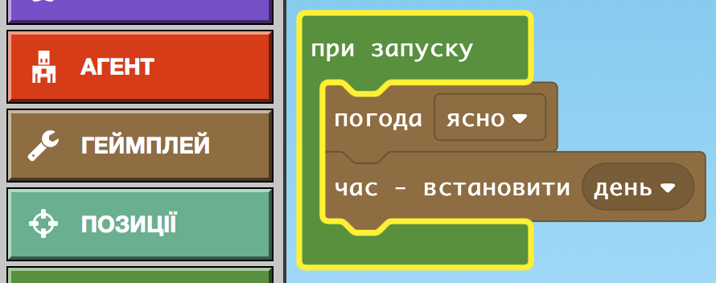
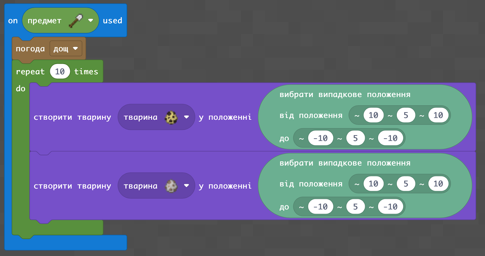
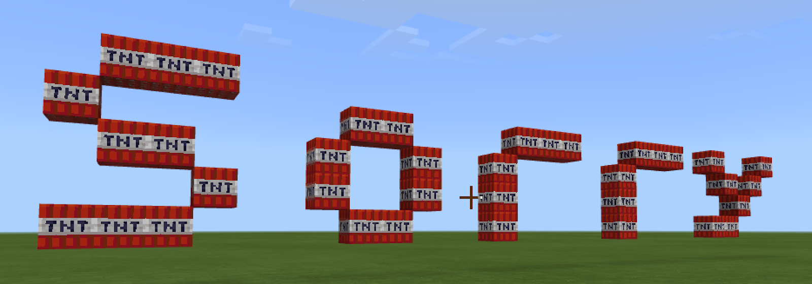
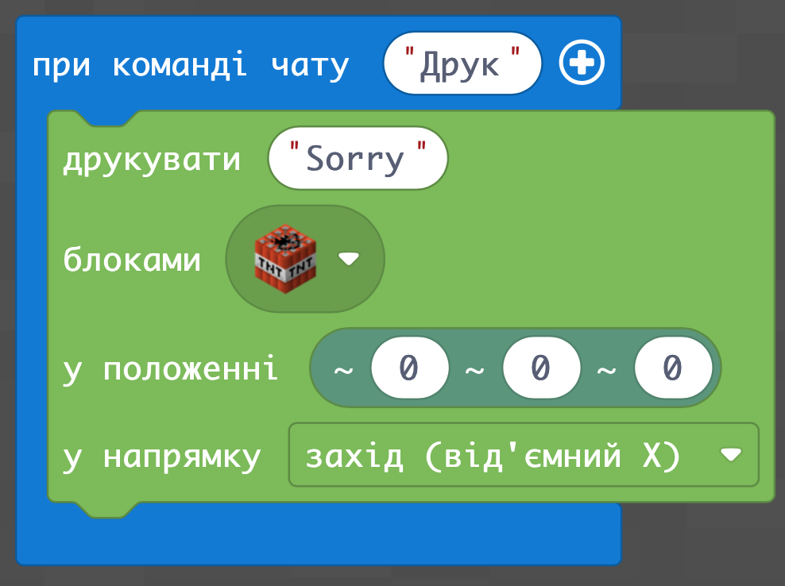
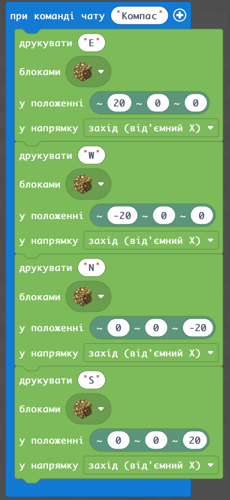
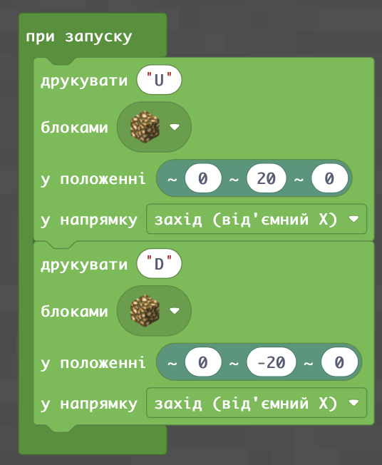
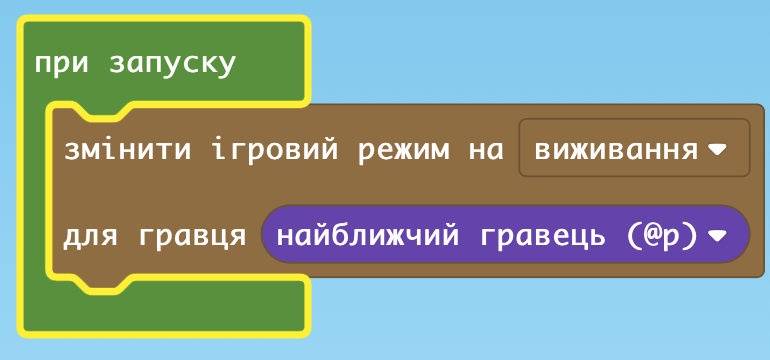
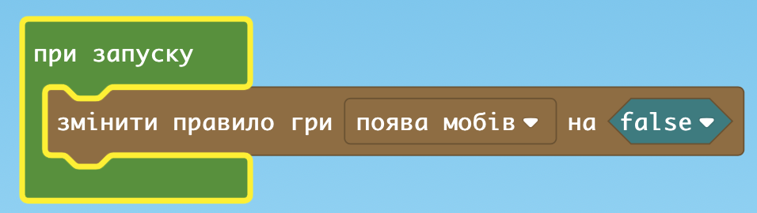
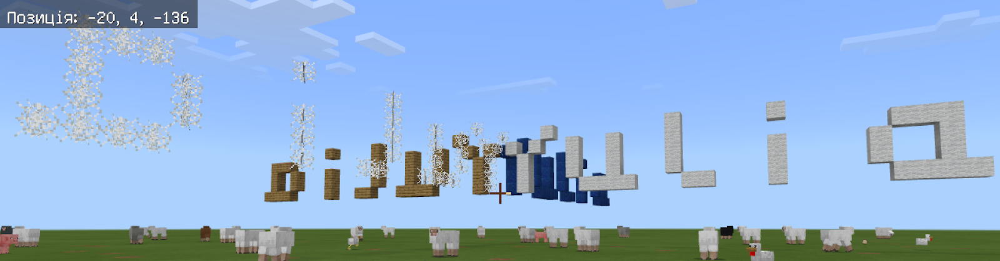
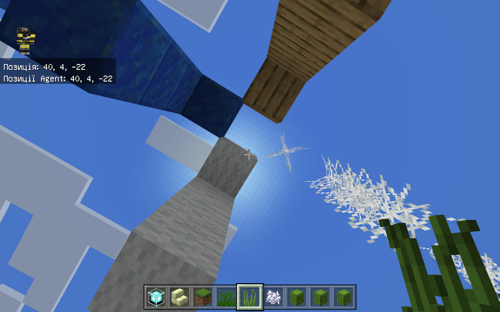

# Заняття 12.

### Використовуємо “Геймплей”

### Створимо тварин під час дощу

### Завдання: Агент будує небезпечну вежу

### Відповідь:

### Малюємо текст

### Компас

### Завдання: напишіть своє англійськими літерами

### Завдання: зайти у спільний світ

Використати “Гемплей”:
 - Змінити режим на “Виживання” для певного гравця”
 - Змінити режим “Пригодницький” для всіх
 - Заборонити сворення мобів
 - Дозволити всім створювати моби
 

### ДЗ: 
написати своє ім’я на всі 4 сторони світу - тобто чотири рази

